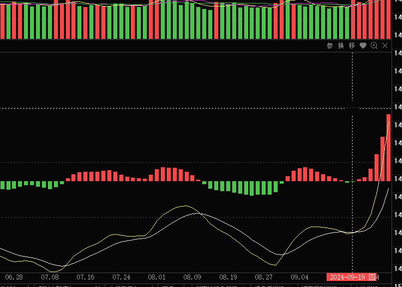
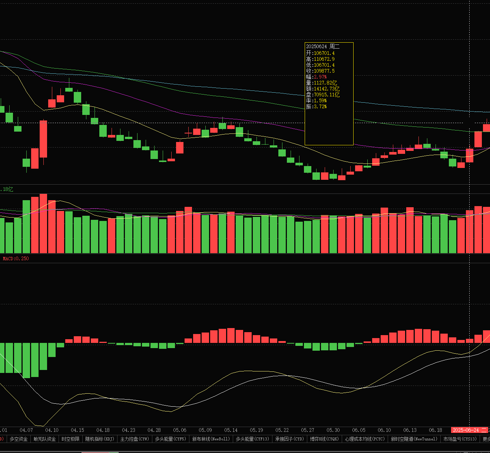
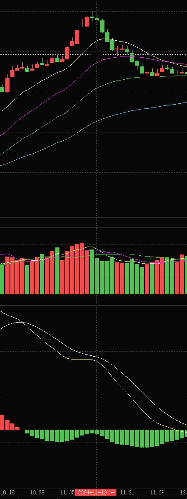

# 复习 2026年5月24日
1. Z 当时在2024年5月20号的时候，就已经让大家可以进入了，从他的天眼数据里面可以看到 ，
	1. 但是在6月26日至6月28日之间，天眼数据已经开始向上拐头，
	2. 从活跃市值里面资金依然显示是流出，但是在24年731和830的时候，出现了巨幅的活跃市值波动分别是6.34和6.82
	3. 而这个时候活跃市值在830的时候出现底部底背离并形成金叉
	4. 
	5. 
	6. ㊙️底部 MACD 结构
		1. 先出现 MACD 底背离，最后出现 MACD 快速死叉后金叉 or 死叉多，并且都没显著形成底部，
		2. 并且要注意金叉空后的下跌加速，<mark style="background-color: #1EFF00; color: black">简单就是绿柱逐步变短的时候，会突然变长</mark>
		3. 所以套穿插 MACD <mark style="background-color: #ff188f; color: yellow">交叉时候的 MACD 值</mark>
			1. 2026年3月13日的 之前3日 MACD 值：-0.204；-0.181；-0.248   这种数值的结构是典型的金叉空
			2. ㊙️<mark style="background-color: #ff188f; color: yellow">-2.3很多情况，出现在交叉空之后</mark>，或者直接出现在，死叉的时候
		4. 
		5. 
	7. 而在5月6号的时候，已经出现活跃市值 MACD 底部金叉
2. 空中加油，适用于 MACD 红柱平稳上行的状态，而死叉直接下去，一般是红柱 MACD 红柱过高后极速回落
