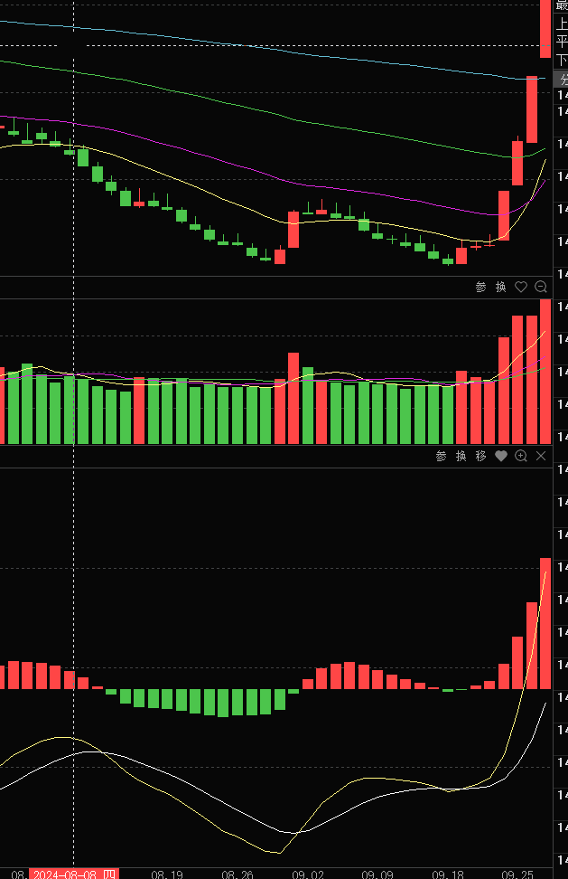

# 复习 2026年5月24日
1. Z 当时在2024年5月20号的时候，就已经让大家可以进入了，从他的天眼数据里面可以看到 ，
	1. 但是在6月26日至6月28日之间，天眼数据已经开始向上拐头，
	2. 从活跃市值里面资金依然显示是流出，但是在24年731和830的时候，出现了巨幅的活跃市值波动分别是6.34和6.82
	3. 而这个时候活跃市值在830的时候出现底部底背离并形成金叉
	4. 
	5. 而在5月6号的时候，已经出现活跃市值 MACD 底部金叉
