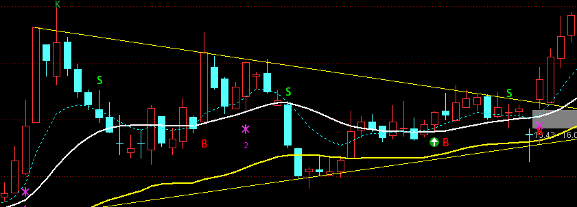
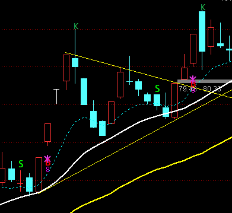
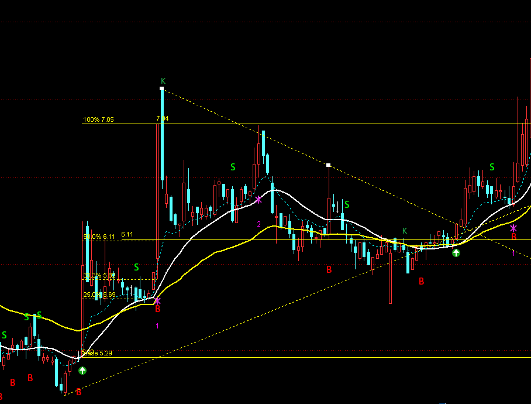
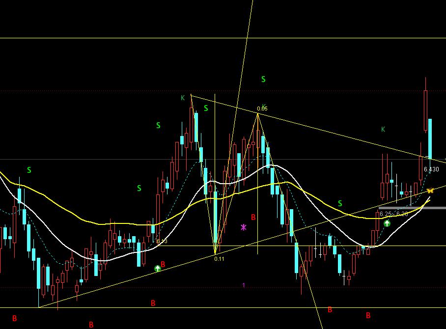
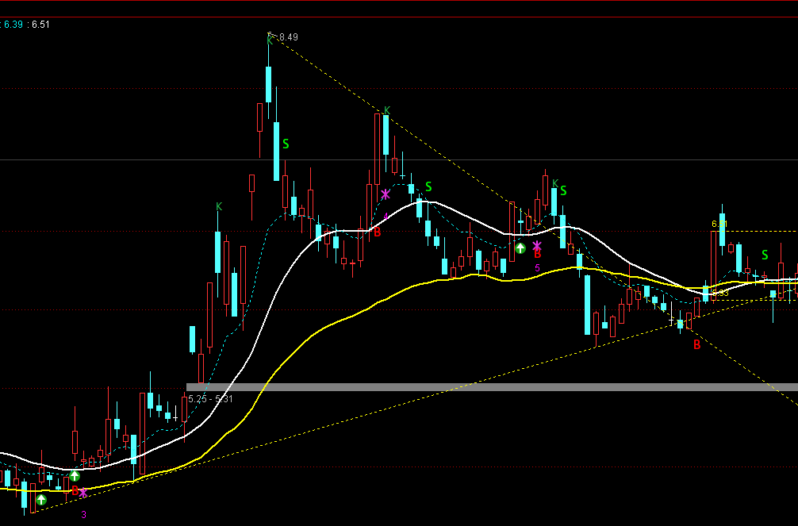

# 🧠📈 情绪周期控制 · 每日记录
## 🍎今日必填 （3分钟搞定）
- 📅 日期:: 
- 💰 今日净盈亏:: A:       B:
- 📉 亏损情绪 Level（0-9）:: 
- 📈 盈利情绪 Gain Level（G0-G5）:: 
- 🧭 市场趋势判断::
	- [ ] 多头
	- [ ] 空头 
	- [ ] 震荡 
	- [ ] 不确定/观望  
- 🌡️ 情绪趋势判断::
	- [ ] 上升（更稳/恢复） 
	- [ ] 震荡（敏感/反复）
	- [ ] 下降（更冲/失控）
	- [ ] 不确定  

- ✅ 明天刻意遵守的 1 条「允许行为」::  
- ⛔ 明天绝对不做的 1 条「禁止行为」::  

# 今日思考
##  2026-01-27
- 
1. 楔形整理后第一根要试盘的
2. 
3. 
4. 
5. 
6. 

---

> [!tip] 🧷 一句话复盘（强制收尾）
> - 我今天做对了什么？✅  
> - 我今天最需要修的是什么？🔧  
> - 我明天只守哪条底线？🛡️  

---

# 🧘 收盘后复原（让你更耐久）
- 🌙 今晚睡眠计划（上床时间/不刷手机）::  
- 🏃 今日运动/拉伸（≥10分钟也算）::  
- 🍽️ 饮食/咖啡因（有没有过量）::  
- 🙏 今日感恩/自我肯定 1 句::  

---

# 📚 情绪等级参考（双链）
## 📉 亏损情绪等级参考（0-9）
![[情绪等级参考库#亏损情绪等级参考（0-9）]]

## 📈 盈利情绪等级参考（G0-G5）
![[情绪等级参考库#盈利情绪等级参考（G0-G5）]]
