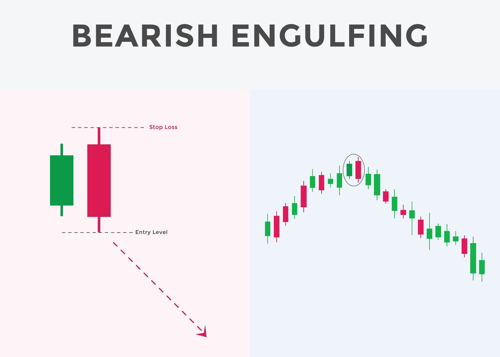

在K线形态学中，**“穿头破脚”**（在西方技术分析中通常被称为**吞没形态**，Engulfing Pattern）是最具杀伤力、也最经典的顶部反转信号之一。当它叠加了“巨大成交量”时，其作为“绝对阶段性顶部”的可靠性会呈指数级上升。

Shutterstock

探索

为了让您在脑海中（或实盘中）精准定位这个图形，我们将其拆解为三个最核心的视觉特征和内在逻辑：

### 1\. 视觉特征：两根K线的“致命拥抱”

这个图形由紧挨着的两根K线组成，通常出现在一段长期或急促的上涨趋势之后（即我们前文提到的“乾为天”或极度亢奋期）。

- **前一日（K线1）：强弩之末的阳线。** 通常是一根中阳线或小阳线，甚至是一个带有上影线的十字星。此时市场情绪依然乐观，但向上的动能其实已经开始衰减。
- **当日（K线2）：泰山压顶的大阴线。** 这是整个形态的灵魂。这根大阴线必须具备以下特征：
	- **“穿头”：** 开盘价必须**高于**前一日的收盘价（甚至高于前一日的最高价），表现为大幅高开。
		- **“破脚”：** 收盘价必须**低于**前一日的开盘价（甚至低于前一日的最低价），表现为单边下挫。
		- **“吞没”：** 从视觉上看，这根大阴线的实体部分，将前一日的整个K线实体（甚至包含上下影线）**完全包裹、吞噬**在内。

### 2\. 量能特征：“巨大成交量”的确认

只有K线形态是不够的，必须有成交量的配合。在这根大阴线出现的当天，成交量必须呈现出**显著的异常放大**（例如是前几日均量的2倍以上，甚至是近几个月的天量）。

- **量价错配：** 正常健康的上涨是“放量收阳”。而在这里，是爆出天量却收出实体极长的大阴线。这说明巨大的交易量并没有转化为向上的推力，反而变成了向下的重压。

### 3\. 筹码博弈与内在逻辑（为什么它具有毁灭性？）

将这个图形放到实盘的资金博弈中，它是一个极其血腥的“关门打狗”过程：

1. **早盘的极致诱多（穿头）：** 受到隔夜利好或极端狂热情绪的驱使，踏空资金在早盘集合竞价不顾一切地涌入，导致股价大幅高开。此时，盘面呈现出“六阳纯极”的假象。
2. **主力的集中派发（天量）：** 就在散户疯狂接盘的同时，暗中潜伏的产业资本、机构主力或游资，利用这巨大的买盘流动性，开始毫无保留地倾泻筹码（这就是巨大的成交量来源）。
3. **情绪的彻底崩溃（破脚）：** 随着主力筹码的不断砸出，买盘被彻底耗尽。股价开始一路单边下挫，不仅跌破了当天的开盘价，还击穿了昨天的收盘价甚至最低价。
4. **死局形成：** 到收盘时，昨天和今天早盘买入的所有多头资金，在一天之内**全部被套牢**。这根放量大阴线，就像一块沉重的墓碑，压在了所有多头的头上。

### 在交易模型中的应对：无条件防守

在量化交易或实战纪律中，如果在相对高位，特别是核心赛道龙头股的加速冲顶阶段（比如之前AI炒作高潮时的CPO概念，或者某些妖股的连板末期），出现了这种“高开低走、实体吞没昨日、且爆出历史天量”的图形，系统给出的指令通常是：

**无条件清仓或大幅减仓，且短期内绝对不可抄底。**

因为这根天量大阴线的最高点，往往会成为未来几个月甚至一两年内都无法逾越的“绝对顶部”。它完美地诠释了易经中“亢龙有悔”的残酷现实：阳气极盛的瞬间，便是毁灭性阴气（抛压）诞生的时刻。