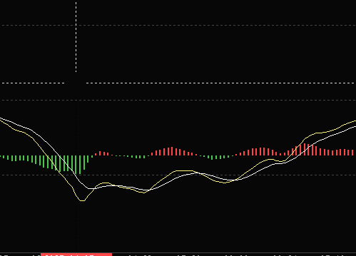
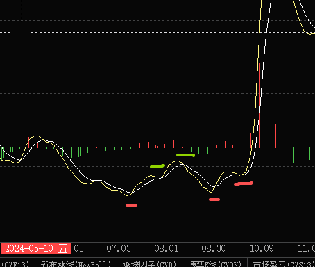
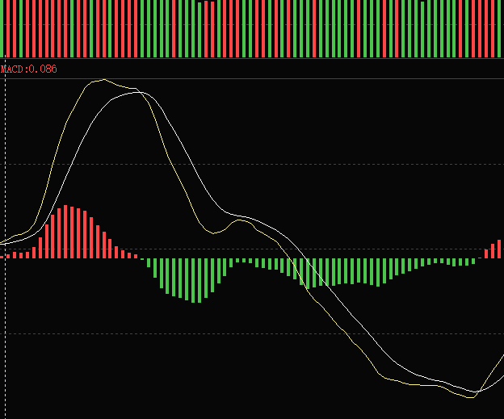

## 活跃市值和 CYC 的关系
### 根据指南针，活跃市值的操盘出击指标，判断波段有一定参考意义
1. 距观察这个指标，源自于 MACD 金叉死叉
2. 活跃市值放巨量的日子，都是上证大跌的日子，918,827
	1. 但<mark style="background-color: #fff88f; color: black">没有统计学意义，应该说活跃放量，也意味着上证方放量</mark>
3. 距观察，活跃下穿 cyc 5 有效性明显优于，上证指数的波段。
	1. <mark style="background-color: #fff88f; color: black">意义不大，不如上证指数破白线第二天没收回效果大</mark>
活跃市值的双底，最少要相等，才能判断趋势改变
高位活跃顶背离要注意，天价中量
好的波段开启是阶梯价，平量。高于前期
波段开启，4 其实就已经是很低的要求了。
用-2.3。确实可以吃满

### MACD 顶背离分析顶部衰竭
- MACD 柱状相对低点 (柱状图的波谷最低低值) 到下一个波峰，定义为一个<mark style="background-color: #fff88f; color: black">左侧上升期</mark>
	- 第一个波峰，往后半个左侧上升周期，为变盘节点。只计算红色柱子，往少数靠近。
		- 第一波峰，是出现第一次顶背离的波峰。
		- 观察 7 月 1-7 月 4
- 这个思考依据是 MACD 顶背离必然会有趋势动能衰减所致，不代表终结，但可能会是一个中继
- 用改该方法可以判断出 2 月 21 日的阶段顶。因为是<mark style="background-color: #fff88f; color: black">加速顶</mark>
	- 24 年 2 月 27 日顶也可以判断
- 这个适合于上升趋势，有惯性在里面。
	- 适合加速区域，比如前面有震荡红柱，但后面顶背离后开启加速，可以从波谷到顶点判断加速衰竭周期。
	- 但如果是横盘震荡，量价顶背离更为敏感，可作为主要信号源。
- <mark style="background-color: #fff88f; color: black">这个判断方法无法判断是见顶，而是判断，上升趋势暂时结束。多半会进入横盘震荡趋势一段时间，这个时候不涨就卖，不要持股。做的紧一些。</mark>
- 这个时候仓位为 3-5 层，最多 5。因为回补很快也可以通过活跃值判断趋势是否延续，也有可能发生板块切换，切去相抵低位板块。（待验证）

> 这个源自周期衰竭和惯性维持
> 由此看出 A 股之所以难做，是因为上升周期极其稀少，
> 	50%震荡，25%的下跌，25%的上涨，能把握的只有 20%都不到。也就 40 天。

活跃市值的 MACD 底部金叉点，逐步抬升，也可作为底背离波段开启的一个关键信号
不是 3 次金叉，儿时三次底背离金叉

再就是看 MACD 底部极值，短线的下方极值为，接近，上一周期，长线的上部极值位，并金叉

>  活跃破 CYC13 是非常关键的指标
>  一但 CYC13 与 CYC5 死叉，就会被 cyc5 压制
>  活跃市值做双底的时候前一天会有加速下杀，然后有一天企稳，
> 	 理论是国家队出手吸筹，稳盘。
> 	 MACD 曲线大坑出现后，会出双底