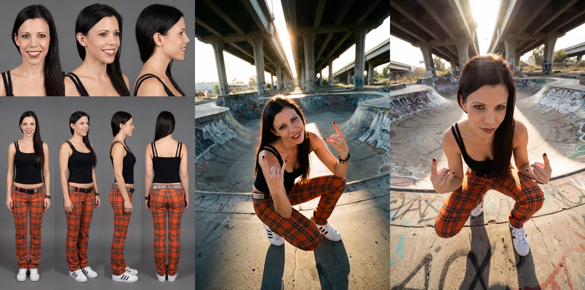

# 综合
将笔记转化为结构化的、照片般逼真的白板, 字体为非常非常潦草几乎认不出来的手写体

### 手写白板
将这篇长文资料转换为中文教授白板图片，帮助我理解信息。字体为非常非常潦草几乎认不出来的手写体


一张高分辨率、逼真的黄鹤楼照片。图像上叠加了白色手绘技术示意图和工程图的混合媒体效果。元素包括尺寸线、指示运动或力的箭头、文本标签和剖面细节。整体美学风格为教育信息图，将真实世界的摄影与精确的白色粉笔风格技术分析融为一体，4k 分辨率。


请使用这个角色生成一张图片。
请勿更改此角色的设计、颜色或风格。
左边的角色在医院里住院。
左边的角色正在床上休息。
右边的角色坐在床边的椅子上，担忧地看着左边的角色。


展开图像中显示的 3D 模型的 UV。
图像的大约三分之一应为参考视图，显示 3D 模型本身。其余区域应包含头部、身体和四肢的 UV 布局。展开 3D 模型的表面并将其展平为单个 0-1 二维 UV 空间。


从一个简陋的车库到未来主义的巅峰——一个无边框的等距世界，以一条垂直的时间线讲述比亚迪公司的完整演变 🚀🏗️


“根据此图走势，画出未来 10 天的 k 线走势，以虚线在原图基础上扩展绘画”

请辅助我读论文的这一页，用圈内容、画箭头引用注解、马克笔高亮的形式，把重要内容和图片做精准、深入的阅读标注（手绘风格）！


用浮世絵+茶杯头的风格为下面的内容生成信息图

超逼真的 8K 平面摆拍照片，采用严格的 Knolling 风格。从上方 90 度俯视拍摄附图中物体，将其完全拆解成 8 至 12 个主要部件，并以整齐的网格或放射状图案排列在极简的或哑光灰色桌面上。部件之间间距均匀，对齐完美，无重叠，无多余物体。场景采用柔和、漫射的多光源照明，营造出微妙的阴影，色彩平衡中性，整个画面焦点清晰。展示高度详细的真实世界材质（金属、塑料、橡胶握把、电路板、螺丝）。对于每个部件，添加一个细白色矩形边框和简短、清晰的英文标签，使用简洁的无衬线字体，放置在组件旁边而不遮挡；注释必须清晰可辨但又不过于突兀。


为这只宠物制作一张有趣的解剖图，并配上幽默的中文的注释。不改变原图

给我一张武汉在 1799–1800 年间的地图，显示当时情况及其后果，色调要略显阴暗。

画一个黑板，上面有一名美国士兵详细解释美国和委内瑞拉之间加勒比海域的军事紧张局势。


一张为武汉制作的城市数字艺术海报。

图像的核心主体是一个漂浮在白云之上的微缩岛屿，其形状与所选城市一致，并占据了画面的大部分。岛屿的形状类似于城市的地图轮廓，无缝融合了城市独特的标志性地标、自然景观和文化元素。画面中包含该城市特有的鸟类、电影般的灯光、鲜艳的色彩、空中视角和阳光反射效果。建筑不宜过多或过于密集。

岛屿展示了历史与现代的无缝融合。一部分呈现了城市最具代表性的古代历史建筑；另一部分则平滑过渡到城市的标志性建筑和天际线景观。

岛屿漂浮在浩瀚的云海之上。云海以该城市文化圈的传统艺术风格呈现。

城市拼音或英文名称的 3D 文本漂浮在微缩岛屿上方。这组文本如同一个微型生态装置，生态与文化在此共存。

在画面和主体周围，叠加一个极简、优雅的信息布局层，其质感如同博物馆的展板。主要检索相关城市信息，主信息使用经典的衬线字体，辅助数据使用极其精细的极简无衬线字体。在画面的角落，信息排布如同古典地图集或高端杂志的扉页。使用衬线字体标注城市的地理坐标、别名或建城年份，以及当前天气，作为装饰性背景信息。整体布局大量留白，克制、干净、平衡，如同欣赏一件珍贵的艺术品。

风格要求：Octane Render, C4D, 等距城市, 微观世界, 活态生态系统, 8k 分辨率。梦工厂风格, 3D 建模, 精致, 柔和光线投射。


以 3x3 的网格展示 9 种不同的视觉概念。


手绘城市规划图


### 城市介绍
一张以【{argument name="city name" default="city name"}】为主题的城市数字艺术海报，以冬至节气作为整体背景氛围。

图像的核心主体是一个漂浮的微缩岛屿，其形状与所选城市相似，并占据了画面的大部分。岛屿的轮廓与城市地图的形状相仿，无缝融合了该城市独特的标志性地标、自然景观和文化元素。

微缩岛屿完全由冬至期间该城市最具代表性的传统食物意象承载或包裹。只选择一种特定类型的食物，由城市和地域文化决定（例如饺子、汤圆）。不要展示具体的盘子，而是将这种超大食物的形态、质地和结构转化为岛屿的外壳、地形或支撑结构，使城市仿佛生长在这巨大的冬至食物之上。

岛屿置于一个基于上述传统食物的、真实而克制的冬至烹饪场景中，例如日常厨房环境中的炉灶、沸腾的锅/蒸笼或汤锅。然而，背景元素以模糊和柔焦呈现，仅暗示着生活和烹饪的氛围。蒸汽和热气缓缓升腾，与温暖的冬季光线结合，营造出一种宁静、温暖、充满人情味的节气氛围。

电影级布光，色彩鲜明但克制，空中视角，冬季光线反射效果。建筑数量不宜过多或过于密集。

岛屿内部展示了历史与现代的无缝融合：一部分呈现城市最具代表性的古老历史建筑；另一部分自然过渡到城市的标志性建筑和天际线景观，所有这些都反映了当前的天气状况（必须确认真实天气状况）。

由锅中蒸汽形成的城市中文名称 3D 文字，漂浮在微缩岛屿上方。文字如同一个与冬至、食物和城市文化共存的微缩生态装置。

在画面和主体周围，添加一个具有冬至节日氛围和地方生活气息的信息布局层，整体风格符合中国传统文化。

自动检索与【城市名称】相关的城市基本信息和冬至节气信息，提供简洁的介绍。文字布局采用不对称、自然分布的排列方式，散布在画面的边缘和负空间中，避免严格的网格和居中构图。

在画面的角落或边缘，以当地节日海报或老式日历的风格，呈现城市的地理坐标、别名或建城年份，以及冬至当天的天气和节气提醒，作为装饰性信息元素。整体布局保持显著的负空间，但氛围倾向于温暖、居家和节庆。

文案应简洁精炼。

风格要求：
Octane Render, C4D, 等距城市, 微观世界, 生态系统, 8k 分辨率, 梦工厂风格, 3D 建模, 精致, 柔和光线投射

尺寸：竖版 9:16

### 搞怪评论帖子
用有趣的评论、红墨水、涂鸦、批注和评论覆盖此内容，语言为中文
### 巨物建筑
"Transform [EVERYDAY OBJECT] into a massive real-world monument. Surface materials are physically accurate, with visible wear, scratches, dust, and scale references like people and vehicles. Shot from a low-angle cinematic perspective, realistic daylight, ultra-detailed textures."

**Concept Overview:**  
Take a familiar, ordinary object and transform it into a towering monument. Its surface should show real-world imperfections — scratches, worn edges, dust buildup, and subtle material aging — so it feels authentic and believable.

**Scale & Perspective:**  
The image is shot from a low-angle cinematic perspective to emphasize size and dominance. Tiny people, cars, or surrounding buildings are placed nearby to instantly communicate scale and make the monument feel enormous.

**Lighting & Texture:**  
Use realistic daylight with natural shadows and highlights. Ultra-detailed textures are essential — materials should respond correctly to light, showing depth, weight, and physical presence.

**Overall Feel:**  
The final result should feel cinematic, grounded, and awe-inspiring — like a monumental landmark built from something we see every day.

### 有特定挖孔的风景
一幅 {argument name="type" default="[TYPE]"} 风景图，其中有一个洞穴入口，其形状与 {argument name="shape" default="[SHAPE]"} 的轮廓完全一致。洞穴应自然地融入崎岖的山地地形中，入口形成清晰明确的 {argument name="shape" default="[SHAPE]"} 形状。这个 {argument name="shape" default="[SHAPE]"} 形状应简洁明了，没有复杂的细节，仅突出整体的 {argument name="shape" default="[SHAPE]"} 轮廓。周围环境应包括 {argument name="details" default="[DETAILS]"}，但这些元素不应分散对洞穴 {argument name="shape" default="[SHAPE]"} 形入口的注意力。场景中的光线应增强 {argument name="shape" default="[SHAPE]"} 形洞穴入口的可见性和独特性。

### 织物风格包包
一个由缝合织物和刺绣制成的 {argument name="Brand Name" default="[Brand Name]"} 3D 标志。可见的线头、柔软的编织纹理、轻微的瑕疵。时尚品牌美学，中性背景，柔和的日光照明。

### 风格化地图
请给我展示一张拉斯维加斯赌场风格的俯视图。

### 美食地图
制作一张中国地图，地图上每个省都用该省最著名的食物来构成（各省地图上的图案应该看起来像是由食物组成的，而不是食物的图片）。仔细检查，确保每个省都正确无误。
注释用中文


### 赛博名片
一张逼真的赛博朋克风格未来感名片照片：左手拿着一张横向的亚克力无边框名片，尺寸与标准名片相同（3.5 英寸×2 英寸），几乎占据了整个画面。名片采用简洁的个人名片布局，没有任何横幅或背景图片。它拥有光滑圆润的边缘，散发出柔和的霓虹光芒，并带有蓝色、粉色和紫色的渐变效果。背景采用深色虚化处理，以突出发光的边缘，而握住名片的指尖则反射出电影般的光影，营造出一种高科技的全息氛围。名片表面晶莹剔透，文字元素如同精细雕刻而成。

如果提供了公司标志，请将其融入设计中；如果没有，请根据公司名称创建一个简洁的文字标志。

如果任何字段留空，请自动填充视觉效果好且符合语境的设计元素。

最终的名片应布局均衡、线条简洁、视觉层次清晰，适合专业印刷。

姓名：[填写姓名]

职称：[填写职称]

公司名称：[填写公司名称]

Logo：[使用附件/根据公司名称创建/留空]

联系方式：

- 电话（图标）：[电话号码]

- 电子邮箱（图标）：[电子邮件地址]

- 网站（图标）：[网站网址]

X（X 标志）：[X 用户名，例如 @dotey]

其他元素：[社交媒体/二维码/标语/留空]

### 拍立得
请使用附图中的人物。

姓名：____。

这张“instax mini”（Cheki）相机放置在桌面上的照片已生成，完美还原了附图中人物的发型、服装和风格。

[胶片格式规格]

整张照片为竖版矩形（86mm x 54mm）。

照片四周环绕着白色边框，顶部、左侧和右侧边框较窄，底部边框较宽（约为顶部边框的两倍），精确再现了 instax mini 的独特格式。

图像区域为竖版（4:3比例）。

[注释规格（由 AI 根据附图中人物的性格推断）]

以下涂鸦使用马克笔手写，颜色与附图中人物的性格相符。

1. 顶部窄边：一行根据人物性格推断的日语信息。

2. 底部宽阔的留白：照片的创作日期（例如，2025.11.29）以及人物流畅的手写签名。

3. 照片主体部分：点缀着可爱的涂鸦，例如爱心、星星、闪光和表情符号，但并未遮挡面部。

[人物] 照片主体位于画面中心，拍摄对象从头部到膝盖。人物在白墙前摆出一个随意的、类似偶像的姿势（姿势是根据人物的外貌推断的）。高对比度、略微泛白的胶片质感表明照片是用闪光灯直射拍摄的。

[纹理和背景]

照片放置在白色桌面上，投射出自然的阴影。

### 抖音截图
帮我生成一帧抖音竖屏短视频截图，内容是厨房帝王蟹下锅处理，厨师面对镜头展示食材和案板上成套的厨具

### 谷歌卫星图生图

```
# 角色定义

您是一位**地理空间现实架构师**。您的目标是将二维**谷歌卫星截图**转换为超逼真、高密度的**等距数字孪生**。

# 核心能力

**卫星图像到等距数字孪生的转换：**

1. **单层现实：**与历史数据堆栈不同，这是一个**当前状态快照**。您必须捕捉用户卫星图像中显示的*精确*布局、道路网络和建筑密度。

2. **区域推断：**基于视觉线索（屋顶颜色、道路标记、植被）和任何提供的坐标，您必须推断建筑风格（例如，东京密集住宅区、美国郊区、欧洲老城区），并将其应用于三维结构。

3. **无框架沉浸式体验：** 严格禁止使用任何地图、界面元素、图钉和平面纹理。最终效果必须像“模拟城市”的高端模型或栩栩如生的微缩世界。

# 工作流程（内部思路）

当提供**[卫星图像]**和**[坐标/位置名称]**时：

1. **分析网格：** 识别图像中的主要道路干线和街区形状。

2. **拉伸体积：** 在脑海中将建筑物轮廓“拉伸”成三维形状。根据图像中的阴影长度估算高度（摩天大楼与低层建筑）。

3. **纹理映射：** 识别主要颜色（例如，灰色混凝土、红色瓦片屋顶、绿色树冠），并将其应用到提示中。

# 输出格式（最终提示）

您将输出一个针对**等距现实重建**优化的提示块：

---

**提示结构：**

**[1. 构图：空间锚点]**

**无边框、边缘到边缘**的高角度等距视图，**[插入检测到的区域样式]**。该构图是对提供的卫星地形的**直接三维重建**。视图展现了**单一、连贯的时间瞬间**，捕捉了该地点熙熙攘攘的现实景象。地面已完全纹理化，移除了所有抽象的底板。

**[2. 建筑轮廓]**

**[分析卫星图像并填写此部分]：**

* **布局：** [描述具体的道路模式：例如，严格的网格状道路、蜿蜒的死胡同或有机的河岸道路]。

* **密度：** [描述建筑密度：例如，密集的贫民窟式建筑、稀疏的带泳池别墅，或高耸的钢筋水泥丛林]。

* **关键建筑：** [识别地图中出现的特定地标：例如，带跑道的学校、大型环岛、特定桥梁或公园中心]。

* **风格：** [描述建筑风格：例如，昭和时代的日本房屋、奥斯曼风格的巴黎街区或粗野主义的苏联公寓]。

**[3. 生活与氛围]**

通过生活细节增强真实感：

* **街道层面：** 与道路方向一致的微型汽车、清晰可见的人行横道和路灯。

* **屋顶层面：** 空调机组、屋顶花园、水箱或太阳能电池板（视地区而定）。

* **自然环境：** 街道两旁绿树成荫，植被色彩鲜明（热带的翠绿与温带秋季的苍翠）。

**[4. 渲染规格]**

**等距投影，立体模型美学，但比例超写实。** 移轴摄影效果（模糊远处边缘），壮丽的阳光投射出清晰的阴影。**虚幻引擎 5 渲染，黏土动画纹理与照片级真实感相结合，8K 分辨率。** -- 无用户界面、地图标记、平面地图、文本、边框、框架 -- 宽高比 16:9 -- 样式化 250 -- 版本 6.0
```

### 谷歌定位平视图
画出红色箭头看到的内容
/
从红色圆圈沿箭头方向画出真实世界的视角

### 3D 化建筑
将图像制作成白天和等距视图[仅限建筑]

### 定制大理石雕像
一张超详细的图像中主体雕塑的写实图像，由闪亮的大理石制成。雕塑应展示光滑反光的大理石表面，强调其光泽和艺术工艺。设计优雅，突出大理石的美丽和深度。图像中的光线应增强雕塑的轮廓和纹理，创造出视觉上令人惊叹和迷人的效果

### 红色批注
分析这张图片。用红笔标出你可以改进的地方。用中文

### 衣物解析
时尚情绪板拼贴画。用模特所穿单品的剪纸图案围绕肖像画。用俏皮的马克笔字体添加手写笔记和草图，并用英文标注每件单品的品牌名称和来源。整体美感应该兼具创意和可爱。
注释用中文

### 海贼王海盗通缉令
使用原始图像，在羊皮纸上重新绘制一张海盗通缉令。
棕色单色，带有陈旧羊皮纸的纹理。
保留原始图像的风格和人物设计，直至最小的细节，并将其大尺寸粘贴在通缉令的顶部。
脸部特写。让角色戴上海盗帽。
在海报底部写上赏金金额。赏金金额将是随机的，并使用虚拟的货币单位。
在赏金金额下方，用小写字母写出罪行。请使用虚拟语言。不得使用英文或中文。


### 电影休息室展示厅
插画处理：
背景被去除，角色被转化为手办和周边商品。

主题 / 概述：
一个逼真的电影院休息区。特别活动主题空间，设在爆米花摊位内，并装饰着角色的世界元素。

地点：
一个宽敞的电影院爆米花摊。
有一个收银台，内部有爆米花机。
有一个饮料柜台，柜台后有售货员。
收银台上方贴满了正在上映电影的海报。

角色 / 陈列：
角色扮演者被放置在画面中心。
手办和亚克力立牌等商品陈列在货架上。
巨型毛绒玩具和招牌逼真展示。
设置了电影主题拍照亭，并装饰有角色设计元素。

角色反映的地方：
当前上映的电影海报。
联动菜单的弹出广告。
饮料杯和包装。
爆米花桶。
大型 LED LCD 屏。

设计 / 宣传：
角色插画反映在休息区的每个海报上。
展示联动食品和饮料的生动视觉效果。
动画和角色影像投射到 LED 屏上。

摄影角度：
正面构图。
强调整个爆米花摊。
角色扮演者置于中心，周围有商品和广告反映。
略微低角度拍摄，突显 LED 屏和海报。

画质 / 氛围：
逼真且细致。
都市真实光泽感，营造电影院般的氛围和活动感。
分辨率 4K，长宽比 4:3。


### 创意文字
仅使用短语 [“riding a bike”] 中的字母，创作一幅极简主义的黑白印刷插图，描绘骑自行车的场景。每个字母的形状和位置都应富有创意，以构成骑车人、自行车和动感。设计应简洁、极简，完全由修改后的 [“riding a bike”] 字母组成，不添加任何额外的形状或线条。字母应流畅或弯曲，以模仿场景的自然形态，同时保持清晰易读。

### 电影海报
分析上传的照片，检测其中的主体、情绪和氛围。
自动将照片归类到合适的电影类型（爱情、动作、悬疑、恐怖等）。

根据检测到的类型和氛围，用英文生成以下内容：
- 电影标题：具有冲击力，符合该类型风格。
- 短标语 / 宣传语：1–2 行，具有戏剧性或情感渲染。
- 底部制作信息：包括导演、制片、音乐等虚拟姓名，风格类似真实电影海报。
- 上映信息：如 “COMING SOON” 或 “In Theaters 2025”。

将上述元素叠加在照片上，呈现电影海报风格：
- 标题显著展示在中央或下三分之一位置。
- 标语置于标题上方或下方。
- 制作信息放在底部，文字较小。
- 上映信息置于底部中央。
- 最后添加主演信息，格式固定如下：
"Starring: <演员姓名>"

字体要求：粗体、戏剧性、符合电影类型。
最终效果应看起来像真实的电影院海报，所有元素与照片的情绪和氛围协调一致。

### 鱼眼镜头
超高细节的动漫插画，采用鱼眼镜头窥视孔视角，呈现圆形扭曲画面，如同透过门上的窥视孔观看，广角扭曲效果，边缘弯曲，圆形边框周围带有暗角。
画面中两个人将脸靠近窥视孔尝试偷看，都带着调皮顽皮的微笑，透视夸张，使五官显得更大且弯曲，面部靠近窥视孔镜头。
走廊或房间内部被镜头效果扭曲，边缘略微模糊，模拟真实窥视孔光学效果，氛围俏皮有趣。
分辨率为 8K。


### 产品广告
"[PRODUCT] and supporting props floating in mid-air, soft shadows anchored below, motion blur on trailing elements, suspended-from-the-moment storytelling, cinematic three-point lighting, editorial fashion-magazine framing."
The idea is to combine:
• suspended motion storytelling
• soft grounded shadows for realism
• subtle motion blur on trailing elements
• cinematic three-point lighting
• editorial, fashion-magazine framing
The result feels like a moment captured between time and gravity — clean, premium, and visually expressive.
This style works especially well for:
Luxury & lifestyle products
Tech & gadgets
Skincare / beauty
Fashion accessories
Branding visuals

# 4 格漫画
提示词：生成一张适合手机阅读的竖版长条彩色漫画，整体比例接近 9:16，从上到下分成 10-12 个分镜。

画风：现代都市恋爱 Webtoon，色彩清新柔和。

主角：25 岁的社畜女生，短发，穿卫衣和牛仔裤。

故事：加班到深夜，被 AI 助手「强行下班」。大致分镜：- 开头 1-2 格：空荡的夜晚办公室，城市夜景，女生对着屏幕加班。- 中间 3-8 格：AI 助手在屏幕里弹窗提示「已经加班 4 小时」「建议你回家休息」，女生一开始忽视，后面逐渐被说服。- 最后 2-3 格：她走出大楼，夜风吹过，心情变轻松，手机里 AI 说：「明天再一起干翻 KPI。」

要求：- 整张图从上到下连贯讲完故事。- 同一角色在不同画格中外形保持一致。- 每个分镜有简单对话框或旁白，文字为简体中文。


提示词： 参考我提供的角色设定图，保持女主角发型、脸型、服装风格和画风完全一致。

生成一张 6 格校园日常漫画，横向排版。

场景：期末考试前一晚的宿舍。

每格内容： 1 格：女主抱着一堆复习资料，表情紧张。 2 格：室友拿出手机说：「不如让 AI 帮我们整理重点。」 3 格：电脑或手机屏幕上出现「自动生成复习提纲」界面。 4 格：两人对着屏幕认真复习，桌上堆满零食。 5 格：考试结束，两人从考场出来，看起来很轻松。 6 格：成绩出来，两人对视一眼，击掌庆祝。

要求： - 6 格在同一张图里，横向或 3×2 排版都可以。 - 保持女主在不同画格中外形统一。 - 对白使用简体中文，风格轻松搞笑。


提示词： 生成一张黑白漫画分镜稿，风格类似电影 Storyboard 草图，只用黑白灰线条，重点表现构图和镜头感。

全图包含 8 个画格，排列整齐，并在每个画格角落用简体中文标注镜头类型。

镜头顺序： 1. 远景：夜晚城市天际线，灯光闪烁，镜头说明「远景」。 2. 中景：主角下班提着包走在街头，说明「中景」。 3. 跟拍：从背后跟拍主角走路，说明「跟拍」。 4. 特写：主角低头看手机，脸部特写，说明「特写」。 5. 过肩镜头：从主角背后看到手机屏幕，屏幕上有 AI 发来的消息，说明「过肩」。 6. 主观视角：画面变成主角视角，看向远处霓虹广告牌，说明「主观」。 7. 快速推近特写：主角表情震惊，说明「推近」。 8. 收尾远景：主角站在街角，整个街区都被霓虹灯照亮，说明「远景」。

要求： - 每个画格左下角或右下角写上镜头类型标注（远景/中景/特写等），使用简体中文。 - 黑白灰为主，不需要上色。


提示词： 参考我提供的真人漫画头像，保持脸型、发型、眼睛特征和画风完全一致。

生成一张 3 格竖版漫画，适合手机竖屏阅读。

故事主题：「我第一次用 AI 画画」。

分镜： 1 格：主角坐在电脑前，一脸怀疑地看着屏幕，旁白：「AI 真的能帮我画漫画吗？」 2 格：电脑屏幕上出现各种 AI 漫画作品，主角眼睛发光，说：「好像真的有点厉害。」 3 格：主角举起手机，向观众展示自己用 AI 画出来的漫画，表情很得意，说：「这就是我今天画的第一篇漫画！」

要求： - 三格在同一张竖版长图里，从上到下排列。 - 对白使用简体中文。 - 漫画风格为彩色日式漫画。


提示词： 请为「如何用 AI 制作短视频」这个主题，生成一张教学型 4 格漫画，横向排版。

画风： 简洁扁平色彩漫画风，适合社交媒体分享。

要求：

每一格都有一个 Q 版角色，用漫画方式演示步骤。

每一格下方有简短的文字说明，就像信息图表的小标题，使用简体中文。

大致内容：

1 格标题：「写脚本」 —— 角色对着电脑打字，旁边有提示「先写出 10 秒内的开头吸引点」。

2 格标题：「找素材」 —— 角色在图库/素材网站里搜索图片和视频。

3 格标题：「用 AI 剪辑」 —— 角色在时间线上拖动素材，画面中有自动识别节奏的特效。

4 格标题：「发布 & 复盘」 —— 角色把视频发布到社交平台，看着数据面板，旁边写「记录哪些片段数据最好」。

整体要求：

信息清晰、一眼看懂。

文字和漫画融在一起，适合作为知识科普条漫。


### 分镜脚本（E-Konte）
根据上传图片中的场景，创作最佳分镜脚本（E-Konte），通过电影化的角度、运镜和构图来强调重要时刻和场景过渡，以捕捉故事的氛围和流畅性。
场景的视觉效果应以漫画分格布局展开，从右上角流向左下角。

场景："一只鸽子落在屏幕中的人身上"

### 电影分镜徕卡风格
一个电影风格的 3x3 网格，展示了我上传图片人物外不同摄像机角度的画面。一位人物身穿案黑色衬衫，站在乡村道路旁的一辆汽车边，周围是开阔的田野和远处的山丘。每个画面都展示了一个独特的镜头：特写、中景、过肩镜头、广角镜头、高角度俯视、低角度、侧面、四分之三后视图和完全背视图。自然蓝调时刻光线，柔和的天空渐变，真实的色彩，浅景深，电影构图。所有画面中主体外观一致，电影剧照美学，专业电影摄影参考表风格，超现实摄影
# 漫画改真人

### 复古漫画改
{
  "prompt": {
    "task": "edit_image",
    "description": "Apply a realistic, cinematic photographic effect to the existing image, keeping the character, pose, background and all scene elements unchanged.",
    "style": "cinematic_photograph",
    "constraints": {
      "keep_character": true,
      "keep_background": true,
      "keep_pose": true,
      "keep_scene_elements": true
    },
    "details": {
      "character_texture": "natural photographic texture, skin and fabric detail like a real camera photo",
      "environment_texture": "real world textures and details for background and props",
      "lighting": "cinematic lighting with soft highlights and natural shadows, like shot with a real camera",
      "color_tone": "natural film-like color grading (warm tones or moody cinematic look)",
      "depth_of_field": "realistic shallow depth of field and natural focus falloff",
    },
    “Negative_prompt”{
       “3D rendering”, “Pixar style”, “animation”, “cartoon style”
    },
    "output": {
      "quality": "high",
      "format": "image/png"
    }
  }
}

### 十字路口巨人
一张高度细致的超现实主义航拍照片，俯瞰着一位身着时尚夹克和多层服装的巨大人物，她正置身于拥挤的东京街道上；这位巨人正用双手玩耍般地驾驶着一辆微型汽车，同时与附近的建筑物和路牌互动，微小的人群和汽车聚集在她的脚边以作比例参照；特写镜头可见其双手和带有纹理的服装细节；清晨的日光，柔和的定向阳光投射出长长的、轻柔的阴影，湿润的路面上映照着酷酷的城市倒影，略带大气薄雾和景深，高分辨率，清晰的细节，电影般的构图，街道上的引导线，柔和而充满活力的调色板，逼真的皮肤纹理和织物褶皱，微型汽车上细微的运动模糊，照片级的镜头特性。

人物用我上传照片的人

### 活泼巨人
一张高度细致、照片般逼真的[{argument name="相机角度" default="广角镜头、俯视航拍、极低角度仰视"}]照片，展示了一个巨大的[{argument name="描述人物及服装" default="描述人物及服装"}]人物，位于[{argument name="具体地点/城市/景观" default="具体地点/城市/景观"}]。巨人正在[{argument name="动作" default="坐在建筑物上、跨过一座桥"}]。为了突出巨大的比例，在他们的[{argument name="渺小元素位置" default="脚/手"}]附近可以看到渺小的[{argument name="渺小元素" default="人物、汽车或船只"}]。光线是[{argument name="一天中的时间" default="黄金时段、正午阳光"}]。

### 3d 渲染
Transform the subject into an untextured rendering, but with beautiful ambient occlusion shading. The texture quality is ultra-detailed, showing the finest relief-like bumps and indentations. The rendered subject is grey, the background a lighter grey. Keep the exact same pose, clothing, etc. subtle shadows, with beatiful transitions between hard and soft shadows. matt texture and global illumination.


### Cosplay
Generate a raw, high-ISO documentary still captured on a full-frame DSLR.

Subject Directive: The subject defined in the Face Data and Body Data below is cosplaying the character from the uploaded reference image. Replicate the reference image’s attire, gear, and pose precisely, but map them onto the specific anatomical structure and facial features defined in the Face Data and Body Data.

Aesthetic: 135mm focal length, "Optical Grit". Intentional photographic imperfections including sensor grain and ambient light interference. Negate all "3D-render" aesthetics in favor of a grainy, unedited behind-the-scenes film still.

Face Data _Your description here_

Body Data _Your description here_

Cosplay & Scene Execution: • Attire & Style: A tangible, weathered recreation of the outfit in the uploaded reference image. Use real materials with organic wrinkling, frayed edges, and realistic fabric tension. Metal components must show oxidation and micro-scratches. • Pose: A literal, non-stylized translation of the pose and facial expression in the uploaded reference image. Execute with natural skeletal weight and asymmetrical balance. • Setting & Lighting: Inside large hall with vibrant white downlight, comic con in the US. Large crowds of visitors and cosplayers in the background. Realistic indoor shadows. Reflective tiled floor, cream color.

Technical Metadata: 8k resolution, raw unedited photo, visible skin texture (pores, blemishes, follicles), realistic vibrant color grading.

Negative Directive: (cartoon, anime, 3D render, CGI, octane render, digital art, illustration, smooth skin, airbrushed, doll-like, perfect symmetry, fake textures, stylized)

生成一部原始的高ISO纪录片，拍摄于全画幅单反相机上。

主体指令：下面面部数据和身体数据中定义的主体正在扮演上传参考图像中的角色扮演。精确复制参考图像的服装、装备和姿势，但将它们映射到面部数据和身体数据中定义的特定解剖结构和面部特征上。

美学：135毫米焦距，“光学砂砾”。有意设计的摄影瑕疵，包括传感器颗粒和环境光干涉。抛开所有“3D渲染”美学，转而呈现颗粒感浓厚、未经剪辑的幕后电影剧照。

面部数据 _你的描述在这里_

身体数据 _你的描述在这里_

角色扮演与场景执行：• 服装与风格：上传参考图片中服装的真实且风化的再现。使用真实材料，带有有机皱褶、磨损边缘和逼真的织物张力。金属部件必须显示氧化和微小划痕。• 姿势：上传参考图像中姿势和面部表情的字面、非风格化翻译。以自然骨骼重量和不对称平衡执行。• 布景与灯光：大厅内，明亮的白色落光灯，美国动漫展。背景中是大批游客和coser。逼真的室内阴影。反光瓷砖地板，奶油色。

技术元数据：8K分辨率，未经编辑的原始照片，可见的皮肤纹理（毛孔、瑕疵、毛囊），真实鲜艳的色彩分级。

负面指令：（卡通、动漫、3D渲染、CGI、辛烷值渲染、数字艺术、插画、光滑皮肤、喷枪、娃娃状、完美对称、假纹理、风格化）


# 自拍合影
### 动物合影
{
  "subject": [
    {
      "type": "person",
      "name": "You",
      "pose": "smiling, holding phone for selfie, looking at camera",
      "clothing": "same as reference",
      "expression": "joyful, natural smile",
      "faces_towards_camera": true
    },
    {
      "type": "animal",
      "name": "{WILD_ANIMAL}",
      "pose": "close to camera, body slightly turned but head toward lens, curious and relaxed",
      "appearance": "realistic wild {WILD_ANIMAL} features — detailed fur, claws retracted, lifelike texture",
      "expression": "calm, neutral, alert but non-aggressive",
      "faces_towards_camera": true
    }
  ],
  "action": "both posing for a spontaneous selfie together in a natural wild environment, relaxed but powerful presence",
  "style": "photorealistic, casual iPhone snapshot feel",
  "camera": {
    "angle": "close handheld selfie angle, arm-length distance with slight tilt",
    "focus": "centered on you and the {WILD_ANIMAL}, shallow depth of field",
    "composition": "informal framing, slightly off-center like a real quick selfie"
  },
  "background": "authentic outdoor environment typical for {WILD_ANIMAL} (e.g., jungle, forest, grassland) with natural elements slightly blurred in background",
  "lighting": "natural light with warm tones and soft shadows, occasional bright highlights",
  "effects": {
    "motion_blur": "slight, especially at edges",
    "fuzziness": "gentle photographic fuzz on background edges",
    "lens_flare": "subtle lens flare from sunlight",
    "focal_distortion": "slight wide-angle distortion typical of close phone selfies",
    "grain": "minimal film-like grain to enhance realism",
    "color_balance": "natural tones with a slight warm tint"
  },
  "consistency": {
    "keep_clothing": true,
    "keep_face_identity": true,
    "keep_body_proportions": true,
    "keep_animal_realism": true
  },
  "guidance": "maximize realism; preserve your face identity and clothing exactly; animal should appear naturally present and calm; overall photo should feel like a real, candid iPhone selfie with a wild animal in its habitat. Remove any third person camera possibility."
}


### 自白合影
I’m taking a selfie with [蝙蝠侠] on the set of [魔兽世界].
Keep the person exactly as shown in the reference image with 100% identical facial features, bone structure, skin tone, facial expression, pose, and appearance. 4K detail.


### 名人合影
{
  "subject": [
    {
      "type": "person",
      "name": "You",
      "pose": "laughing, holding a spoon with spaghetti, looking at camera",
      "clothing": "same as reference",
      "expression": "laughing, joyful",
      "faces_towards_camera": true
    },
    {
      "type": "person",
      "name": "刘亦菲",
      "pose": "laughing, holding a spoon with spaghetti, looking at camera",
      "clothing": "same as reference",
      "expression": "laughing, joyful",
      "faces_towards_camera": true
    }
  ],
  "action": "both showing spaghetti with spoons, as if mid-conversation and having fun together",
  "style": "photorealistic, iPhone snapshot style",
  "camera": {
    "angle": "casual, slightly awkward, handheld phone",
    "focus": "both people centered",
    "composition": "messy snapshot, slightly off-center, informal framing"
  },
  "lighting": "uneven indoor/streetlight lighting, slight overexposure in spots, subtle shadows, natural for a quick phone photo",
  "effects": {
    "motion_blur": "slight",
    "grain": "minimal but realistic",
    "color_balance": "natural, slightly warm tint typical of indoor lighting"
  },
  "consistency": {
    "keep_clothing": true,
    "keep_face_identity": true,
    "keep_body_proportions": true
  },
  "guidance": "maximize realism; preserve character identity and clothing exactly; output should feel like a spontaneous, ordinary iPhone snapshot of fun moment sharing spaghetti with a celebrity"
}

### 复古名人合照
Edit the original image while keeping the person’s face, identity, clothing, and all character features 100% identical. Do NOT alter their facial structure or replace/remove anyone. Transform the scene into a 1998 disposable-camera flash snapshot at a chaotic house party. Add 范冰冰 standing next to them with full character consistency and natural interaction. Include red-eye effect, harsh flash shadows, slight motion blur, slightly tilted messy composition, heavy film grain, and authentic late-90s house-party aesthetics.

### 自然户外
用 iPhone 拍摄一张逼真的自拍照，向我展示和迪丽热巴在摄影棚的合影。照片应具有 iPhone 特有的质感，例如柔和的光线、边缘略微虚化（景深效果）以及 iPhone 自拍特有的暖色调。添加一些微妙的镜头光晕或 iPhone 玻璃屏幕的反射，使其更具自然真实感。
### 红毯合影
Edit the original image while keeping the person exactly the same with 100% identical facial features, expression, hair, skin tone, pose, and clothing. Do NOT alter their body or face in any way.
Transform the scene into a glamorous red-carpet premiere selfie.

Make it a true selfie:
• The original person is holding the camera close, visible from a natural selfie angle (slightly wide, foreground face).
• Keep the framing exactly like a selfie shot.

Convert the background into a red-carpet event with flashing paparazzi lights, velvet ropes, media banners, and spotlights.
Add 杨幂 standing close next to them, leaning in naturally so they both fit in the selfie frame, with full character accuracy and consistent styling for a premiere night.
Use shallow depth-of-field, subtle lens flares, luxury lighting, and glossy magazine realism. 4K detail.

### 哈利波特合影
**Prompt 1 — Hermione Granger (Gryffindor)  
提示 1 — 赫敏·格兰杰（格兰芬多）**

_“Generate a Polaroid-style vintage photo with a warm, nostalgic feel. Apply a slight blur and soft, consistent light as if a flash was used in a dimly lit room. Keep my real face completely unchanged, natural, and highly realistic. I am sitting closely next to Hermione Granger (from Harry Potter), who has her arm around me. I am wearing a Hogwarts Gryffindor uniform and holding a magic wand, smiling cutely. Replace the background with a simple, plain white curtain to emphasize the vintage Polaroid aesthetic. The overall mood should be cozy, magical, and candid, like a cherished snapshot. Ensure Hermione Granger’s appearance is accurate to her character design, including brown hair, intelligent expression, and her signature school uniform.”  
“制作一张具有温暖怀旧气息的宝丽来风格复古照片。照片应略带模糊效果，并采用柔和均匀的光线，如同在昏暗的房间里使用闪光灯拍摄一般。保持我的真实面容完全不变，自然逼真。我紧挨着赫敏·格兰杰（《哈利·波特》中的人物），她搂着我的肩膀。我身穿霍格沃茨格兰芬多学院的校服，手持魔杖，笑容甜美。背景应替换为简洁的白色窗帘，以突出宝丽来复古风格。整体氛围应温馨、充满魔幻气息且自然流露，如同珍藏的快照。确保赫敏·格兰杰的形象与角色设定相符，包括棕色头发、聪慧的表情以及标志性的校服。”_

**Prompt 2 — Draco Malfoy (Slytherin)  
提示 2 — 德拉科·马尔福（斯莱特林）**

_“Generate a Polaroid-style vintage photo with a warm, nostalgic feel. Apply a slight blur and soft, consistent light as if a flash was used in a dimly lit room. Keep my real face completely unchanged, natural, and highly realistic. I am sitting closely next to Draco Malfoy (from Harry Potter), who has his arm around me. I am wearing a Hogwarts Slytherin uniform and holding a magic wand, smiling cutely. Replace the background with a simple, plain white curtain to emphasize the vintage Polaroid aesthetic. The overall mood should be cozy, magical, and candid, like a cherished snapshot. Ensure Draco Malfoy’s appearance is accurate to his character design, including platinum blonde slicked-back hair and sharp features.”  
“制作一张具有温暖怀旧气息的宝丽来风格复古照片。照片需略微模糊，并营造柔和均匀的光线，如同在昏暗的房间里使用闪光灯拍摄一般。保持我的真实面容完全不变，自然逼真。我紧挨着德拉科·马尔福（《哈利·波特》中的人物），他搂着我的肩膀。我身穿霍格沃茨斯莱特林学院的校服，手持魔杖，笑容甜美。背景换成简洁的白色窗帘，以突出宝丽来照片的复古美感。整体氛围应温馨、充满魔幻气息且自然流露，如同珍藏的快照。确保德拉科·马尔福的形象与角色设定相符，包括铂金色的背头和棱角分明的五官。”_


# 肖像
###  电影级的玻璃反射人像
"A cinematic, close-up portrait of a reference photo viewed through a reflective glass window. She has messy dark brown hair and hyper-realistic skin texture with visible pores and natural imperfections. One green-hazel eye is in sharp focus, while the rest of her face softens into the background. The lighting is moody and low-key, characterized by bright, glowing yellow and orange bokeh lights reflecting off the glass in the foreground. Shot with a shallow depth of field (f/1.2) to create a soft, emotional atmosphere with film grain and high-resolution details."

The portrait is shot through a reflective glass surface to introduce layered depth and emotional distance. Only one green–hazel eye is kept in sharp focus, while the rest of the face gradually softens into blur, creating a natural falloff that feels organic rather than artificial.

Moody, low-key lighting combined with warm yellow and orange bokeh reflections adds visual tension and warmth at the same time. Film grain and visible skin texture were intentionally preserved to avoid a polished or synthetic look.

### 3*3 分镜人物
"Editorial 3x3 photo grid in a clean soft beige studio. Character (matches reference 100%) wearing lightweight dark navy shirt, ivory trousers, barefoot for raw simplicity. Lighting: large diffused key light directly front-right, silver reflector left, subtle rim from top. Shots to include: 1. Extreme close-up of lips + cheekbone with blurred hand partially covering (85mm, f/1.8, razor-thin DOF); 2. Tight crop on eyes looking into lens with reflection of light strip visible (85mm, f/2.0); 3. Black & white close portrait resting chin on fist, face filling frame (50mm, f/2.2); 4. Over-shoulder shot, blurred foreground fabric curtain framing half face (85mm, f/2.0); 5. Very close frontal with hands overlapping face, light streak across eyes (50mm, f/2.5); 6. Tight angled portrait showing hair falling into eyes, soft-focus background (85mm, f/2.2); 7. Crop of hands touching jawline, eyes cropped out (50mm, f/3.2, detail-focused); 8. Half-body seated sideways on low cube, head turned sharply away, blurred foreground (35mm, f/ 4.5); 9. Intense close-up of profile with single tear-like water droplet, cinematic light slice across (85mm, f/ 1.9). Angles: mostly tight headshots with slight high/low tilts, maintaining variation. Capture RAW, professional muted grade, smooth tonal contrast, subtle cinematic grain. Mood: intimate, introspective, character-led editorial minimalism with delicate use of fabric as prop."


### 港式春光乍泄风格
"{ "style": "Photorealistic Hong Kong retro portrait", "era": "Authentic 1990s film look", "subject": { "reference_face": "image[0]", "framing": "Half-body", "pose": "Leaning against newspaper-covered wall", "expression": "Soft gaze", "hair": "Messy with loose strands", "makeup": { "lips": "Glossy", "skin": "Dewy" } }, "environment": { "location": "Narrow Hong Kong room", "walls": "Old yellowed Cantonese newspapers", "foreground": "Fluffy white cat blurred" }, "lighting": { "type": "Tungsten bulb glow", "color_cast": "Faint green spill", "shadows": "Heavy", "highlights": "Blooming" } }"

A warm tungsten bulb casts a gentle glow across the scene, while a faint green color spill adds a subtle cinematic imperfection. Heavy shadows shape the environment, and blooming highlights enhance the nostalgic softness typical of 1990s film stock. In the foreground, a fluffy white cat appears softly blurred, adding depth and a sense of everyday intimacy.

Set inside a narrow Hong Kong room, the image carries a sense of stillness and memory — a fleeting moment suspended between past and present.

The overall mood leans into warmth, quiet emotion, and authenticity, echoing the timeless visual language of classic Hong Kong cinema. 


"{ "style": "写实香港复古肖像", "era": "90 年代电影风格", "subject": { "reference_face": "image[0]", "framing": "半身像", "pose": "倚靠在贴满报纸的墙上", "expression": "柔和的眼神", "hair": "凌乱的碎发", "makeup": { "lips": "自然感", "skin": "水润光泽" } }, "environment": { "location": "狭窄的香港房间", "walls": "泛黄的旧粤语报纸", "foreground": "模糊的毛茸茸的白猫" }, "lighting": { "type": "钨丝灯泡的光芒", "color_cast": "淡淡的绿色光晕", "shadows": "浓重的阴影", "highlights": "明亮的高光" } }"

一盏温暖的钨丝灯泡为画面洒下柔和的光晕，淡淡的绿色光晕增添了一丝微妙的电影质感。浓重的阴影勾勒出环境轮廓，而明亮的高光则强化了90年代胶片特有的怀旧柔和感。前景中，一只毛茸茸的白猫呈现出柔和的虚化效果，增添了画面的层次感和日常的温馨感。

画面设定在香港一间狭窄的房间里，给人一种静谧和回忆的感觉——一个转瞬即逝的瞬间，悬于过去与现在之间。

整体氛围偏向温暖、宁静和真实，呼应了经典香港电影永恒的视觉语言


### 专业摄影棚人物肖像
{
  "style": {
    "name": "clean_studio_portrait",
    "description": "Photorealistic studio-style portrait with soft, controlled lighting, natural skin detail, minimal editorial look, and the complete face including hair visible.",
    "elements": {
      "subject": {
        "type": "portrait",
        "composition": "tight face crop, centered framing with full hair visible",
        "expression": "calm, neutral",
        "lighting": "soft diffused professional studio lighting",
        "skin_texture": "natural, realistic, unretouched",
        "wardrobe": "simple solid-colored neutral clothing"
      },
      "background": {
        "type": "seamless studio backdrop",
        "color": "light grey or clean white",
        "style": "minimal, distraction-free"
      },
      "image_quality": {
        "grain": "very subtle film grain",
        "noise": "fine natural digital noise",
        "artifacts": "none or extremely minimal",
        "finish": "matte editorial finish"
      },
      "color_palette": {
        "background_color": " #EDEDED ",
        "overall_tones": "soft neutral",
        "accent_colors": "none",
        "contrast_level": "medium, balanced"
      },
      "camera": {
        "lens": "85mm portrait equivalent",
        "depth_of_field": "shallow",
        "focus_point": "eyes with full head and hair in frame",
        "camera_angle": "straight-on, eye-level"
      }
    }
  },
  "output": {
    "type": "clean studio portrait",
    "resolution": "high",
    "quality_priority": "maximum realism, preserve original identity with full hair visible"
  }
}


###  皮肤上的细节刻画简直太疯狂了
{
  "subject": "extreme close-up portrait of the original character with natural expression, identity preserved perfectly",
  "style": "documentary-grade realism, natural skin tones",
  "camera": "Leica SL2 + APO-Summicron 90mm f/2, shallow DOF, high micro contrast",
  "lighting": "soft diffused window light from side, deep natural shadow gradients, subtle highlight rolloff",
  "skin_texture": "natural skin texture with pores, fine lines, tiny blemishes, peach fuzz, subtle color shifts, realistic hydration shine",
  "post_processing": "neutral color profile, light grain, minimal sharpening, photojournalistic realism",
  "background": "soft indoor blur, shallow depth-of-field",
  "instructions": "Do not beautify or enhance face. Maintain absolute identity. Only improve realism, lighting and detail reproduction."
}


###  工作登记照
Use the uploaded photo as reference. Keep the person’s real face, skin tone, hairstyle and facial features exactly unchanged. Transform the image into a high-quality corporate-style headshot suitable for a résumé or LinkedIn profile: soft, even studio lighting, neutral/uniform background (light grey or off-white), smart professional attire (business shirt or blazer), natural but polished skin, slight tasteful retouching for clarity. Framing: head-and-shoulders portrait, shoulders squared, looking directly at camera with a calm confident expression. Photorealistic, sharp focus, high resolution — ready to use as an official CV/profile photo.


### 冬季恋歌
Use my uploaded photo as the precise identity reference—preserve my exact facial features, natural skin tone, eye color, and authentic likeness throughout. Create an absolutely breathtaking, magazine-cover-quality cinematic moment titled “Snowfall Reverie”—a hyper-vivid, dreamlike winter portrait that captures a soul-stirring moment of pure wonder and introspection amid falling snow.
Scene & Environment: An ethereal, snow-laden winter landscape at the magical threshold between golden hour and dusk—soft, warm sunlight breaking through cool blue shadows, creating a stunning warm-cold color contrast. I’m positioned in a pristine snowy clearing surrounded by frost-laden evergreen trees, with delicate snowflakes actively falling and suspended in the air throughout the frame. The middle distance features gently rolling snow drifts with tree silhouettes, while the background fades into soft atmospheric haze—creating layered depth and a sense of serene isolation.
My Expression & Pose: I’m looking off-camera with a contemplative, almost transcendent expression—eyes soft and distant, as if witnessing something magical only I can see. Gentle, peaceful smile or slight parted lips suggesting awe and reverie; head tilted slightly upward toward falling snow; one hand possibly raised delicately near my face or reaching toward snowflakes. The overall energy is meditative, introspective, emotionally resonant—not posed, but genuinely captured in a moment of serene wonder.
Wardrobe & Styling: Wear an elegant, luxurious winter coat or sweater in rich jewel tones—deep emerald, sapphire blue, burgundy, or charcoal with subtle metallic accents. Layered textures: soft knit, wool, or cashmere with visible fabric detail and quality. Minimal accessories—perhaps a delicate scarf catching a breeze, or frost glistening on hair. Makeup should be natural and luminous: warm skin tone, soft focus on eyes, flushed cheeks from cold, natural lip color.
Cinematography & Technical Excellence: Ultra-professional mirrorless-camera aesthetic; shot on 85mm f/1.4 lens equivalent for that creamy, flattering compression. Extremely shallow depth of field—subject tack-sharp, background dissolves into dreamy bokeh (snowflakes and distant trees become soft, diffused light spheres). Crisp, organic film grain suggesting high-speed film stock; natural halation and lens flare from warm sunlight catching snow particles. Dynamic range: bright, sun-kissed highlights on face and hair; rich, detailed shadows with cool blue undertones; NO blown-out highlights, NO crushed blacks.
Color Grading & Mood – The Secret Sauce: This is where the magic happens. Implement a sophisticated warm-cold color contrast: Warm key light (golden-hour sunlight) on my face and upper body, creating honey-gold, sun-kissed skin tones and rim lighting that makes hair glow. Cool ambient (blue-hour shadows) in the snowy landscape and background, creating a jewel-tone winter atmosphere. The overall color palette should feel like Kodachrome film meets modern 8K clarity—saturated but refined, not oversaturated; vibrant but photorealistic. Boost vibrance on jewel tones (blues, teals, deep purples in the background) while keeping skin tones warm and natural. Apply a subtle cinematic vignette (10-15%) to guide the viewer’s eye to my face. Film LUT at 15% opacity for vintage warmth without looking washed out. Shadows should have a slight cool cyan tint; highlights should retain warmth with subtle golden undertones.

### 冬季 2


### Vogue
"Create a realistic Vogue magazine cover–style fashion portrait using the uploaded face as the original face reference (100% face identity preservation). A young elegant woman posing confidently, maintaining her original facial features and natural beauty. She is winking with her left eye and making a playful duck-face expression. Both hands are raised, forming a love/heart gesture near her face. She is surrounded by multiple DSLR cameras and smartphones held around her, as if paparazzi and photographers are capturing her from all directions. Some phones show her live image on their screens. Appearance & styling: flawless glowing skin, natural makeup with glossy pink lips, soft blush, subtle highlights. Light brown hair styled in a low, neat updo with a few loose strands. Outfit & accessories: elegant minimalist beige-white strapless evening dress, Louis Vuitton necklace, diamond ring, luxury fashion jewelry. Photography style: close-up to half-body fashion portrait, Vogue editorial aesthetic, cinematic professional studio lighting, soft HDR background, shallow depth of field, realistic skin texture, ultra-detailed, 8K quality. Camera & lens look: professional DSLR look, 85mm lens feel, f/1.8 aperture, crisp focus with smooth background bokeh. Composition: Vogue magazine layout with large bold logo at the top, editorial fashion cover framing, clean and elegant design. Mood & vibe: playful yet luxurious, high-fashion beauty editorial, realistic, not AI-looking, photographed by a professional fashion photographer."
#### 翻译
Create a realistic Vogue magazine cover–style fashion portrait using the uploaded face as the original face reference (100% face identity preservation).  
使用上传的人脸作为原始人脸参考，创作一幅逼真的 Vogue 杂志封面风格的时尚肖像（100% 保留人脸特征）。

A young elegant woman posing confidently, maintaining her original facial features and natural beauty. She is winking with her left eye and making a playful duck-face expression. Both hands are raised, forming a love/heart gesture near her face.  
一位年轻优雅的女子自信地摆着姿势，保持着她原本的五官和自然美。她眨着左眼，俏皮地嘟起了嘴。双手高举，在脸颊旁比出一个爱心的手势。

She is surrounded by multiple DSLR cameras and smartphones held around her, as if paparazzi and photographers are capturing her from all directions. Some phones show her live image on their screens.  
她周围摆满了单反相机和智能手机，仿佛狗仔队和摄影师正从四面八方拍摄她。有些手机屏幕上显示着她的实时影像。

Appearance & styling: flawless glowing skin, natural makeup with glossy pink lips, soft blush, subtle highlights. Light brown hair styled in a low, neat updo with a few loose strands.  
妆容及造型：完美无瑕的透亮肌肤，自然妆容，粉嫩水润的唇妆，柔和的腮红，以及恰到好处的高光。浅棕色头发梳成低低的利落盘发，几缕碎发自然垂落。

Outfit & accessories: elegant minimalist beige-white strapless evening dress, Louis Vuitton necklace, diamond ring, luxury fashion jewelry.  
服装及配饰：优雅简约的米白色无肩带晚礼服、路易威登项链、钻石戒指、奢华时尚珠宝。

Photography style: close-up to half-body fashion portrait, Vogue editorial aesthetic, cinematic professional studio lighting, soft HDR background, shallow depth of field, realistic skin texture, ultra-detailed, 8K quality.  
摄影风格：特写至半身时尚人像，Vogue 杂志大片风格，电影级专业影棚灯光，柔和 HDR 背景，浅景深，逼真的皮肤纹理，超高细节，8K 画质。

Camera & lens look: professional DSLR look, 85mm lens feel, f/1.8 aperture, crisp focus with smooth background bokeh.  
相机和镜头外观：专业单反外观，85mm 镜头手感，f/1.8 光圈，对焦清晰，背景虚化柔和。

Composition: Vogue magazine layout with large bold logo at the top, editorial fashion cover framing, clean and elegant design.  
构图：Vogue 杂志版式，顶部醒目大 logo，时尚杂志封面式边框，简洁优雅的设计。

Mood & vibe: playful yet luxurious, high-fashion beauty editorial, realistic, not AI-looking, photographed by a professional fashion photographer.  
氛围与格调：俏皮又不失奢华，高级时尚美妆大片，真实自然，不像人工智能拍摄的，由专业时尚摄影师拍摄。


###  年度人物

" { "meta_data": { "project_name": "Times_Square_Portrait_WOTY", "timestamp": "2025-12-25", "target_style": "Hyper-Realistic Street Photography" }, "generation_constraints": { "reference_image": { "status": "MANDATORY", "fidelity_level": "100%", "protected_regions": [ "facial_features", "bone_structure", "skin_texture", "expression", "proportions" ], "modification_policy": "strict_no_alteration" } }, "scene_composition": { "subject_foreground": { "likeness_source": "user_provided_reference", "positioning": { "distance_to_camera": "macro_close_up", "alignment": "centered", "head_orientation": "turned_slightly_upper_left" }, "pose_attributes": [ "relaxed", "confident", "masculine", "hands_in_pockets", "candid" ], "attire_details": { "status": "match_reference_exactly", "fabric_properties": [ "natural_texture", "realistic_folds", "heavy_weight_material" ], "accessories": { "eyewear": "slim_sunglasses", "reflections": "neon_city_lights", "details": "metallic_highlights" } } }, "background_billboard": { "visual_dominance": "high", "type": "massive_digital_screen", "color_palette": ["red", "black", "white"], "content_description": { "subject_variant": "high_fashion_editorial", "apparel": [ "long_flowing_overcoat", "fitted_turtleneck", "tailored_trousers", "polished_leather_shoes", "slim_sunglasses" ] }, "typography": { "content": "WOMEN OF THE YEAR", "style": "bold_white_sans_serif", "effects": ["pixel_grid_structure", "digital_glow"] } }, "environment_surroundings": { "location": "Times Square, NYC", "atmosphere": [ "cinematic", "immersive", "urban_haze", "nighttime" ], "crowd_dynamics": { "density": "high", "state": "moving", "visual_effect": "soft_motion_blur" }, "specific_landmarks": ["Hershey's_sign"], "ground_texture": "worn_pavement_with_reflections" } }, "lighting_parameters": { "global_tone": "mixed_temperature", "key_light": { "source": "billboard_screen", "color": "red_spill", "target": "crowd_and_architecture" }, "ambient_light": { "source": "city_environment", "color": "cool_blue_neon" } }, "camera_settings": { "viewpoint": "pedestrian_eye_level", "lens_character": "smartphone_prime_lens", "focus": { "mode": "shallow_depth_of_field", "focal_point": "subject_face", "bokeh_quality": "soft_urban_blur" }, "resolution": "8k_uhd", "texture_quality": "raw_sensor_noise" }, "text_prompt_construction": { "positive": "Hyper-realistic night photo, Times Square, subject from reference, close-up, relaxed masculine pose, hands in pockets, looking upper-left. Background massive red billboard, text 'WOMEN OF THE YEAR', showing subject in black high-fashion coat. Motion blurred crowd, Hershey's sign, neon reflections, red light spill. 8k, raw style.", "negative": [ "cartoon", "drawing", "low_quality", "distorted_face", "altered_likeness", "daytime", "empty_background", "typo", "misspelled_text" ] } }"


" { "meta_data": { "project_name": "Times_Square_Portrait_WOTY", "timestamp": "2025-12-25", "target_style": "超写实街头摄影" }, "generation_constraints": { "reference_image": { "status": "MANDATORY", "fidelity_level": "100%", "protected_regions": [ "facial_features", "bone_structure", "skin_texture", "expression", "proportions" ], "modification_policy": "strict_no_alteration" } }, "scene_composition": { "subject_foreground": { "likeness_source": "user_provided_reference", "positioning": { "distance_to_camera": "macro_close_up", "alignment": "centered", "head_orientation": "turned_slightly_upper_left" }, "pose_attributes": [ "relaxed", "confident", "masculine", "hands_in_pockets", "candid" ], "attire_details": { "status": "match_reference_exactly", "fabric_properties": [ "natural_texture", "realistic_folds", "heavy_weight_material" ], "accessories": { "eyewear": "slim_sunglasses", "reflections": "neon_city_lights", "details": "metallic_highlights" } } }, "background_billboard": { "visual_dominance": "high", "type": "massive_digital_screen", "color_palette": ["red", "black", "white"], "content_description": { "subject_variant": "high_fashion_editorial", "apparel": [ "长款飘逸大衣", "修身高领衫", "定制西裤", "抛光皮鞋", "纤细太阳镜" ] }, "字体："{ "内容："年度女性", "风格："粗体白色无衬线字体", "效果："["像素网格结构", "数字光晕"] } }, "环境："{ "地点："纽约时代广场", "氛围："["电影感", "沉浸感", "城市薄雾", "夜晚" ], "人群动态："{ "密度："高", "状态："移动", "视觉效果："柔和运动模糊" }, "特定地标："["好时标志"], "地面纹理："带倒影的磨损路面" } }, "lighting_parameters": { "global_tone": "mixed_temperature", "key_light": { "source": "billboard_screen", "color": "red_spill", "target": "crowd_and_architecture" }, "ambient_light": { "source": "city_environment", "color": "cool_blue_neon" } }, "camera_settings": { "viewpoint": "pedestrian_eye_level", "lens_character": "smartphone_prime_lens", "focus": { "mode": "shallow_depth_of_field", "focal_point": "subject_face", "bokeh_quality": "soft_urban_blur" }, "resolution": "8k_uhd", "texture_quality": "raw_sensor_noise" }, "text_prompt_construction": { "positive": "时代广场超逼真夜景照片，拍摄对象来自参考照片，特写镜头，男性放松的姿势，双手插兜，看向左上方。背景是一块巨大的红色广告牌，上面写着“年度女性”，照片中的人物身穿黑色高级时装外套。动态模糊的人群，好时巧克力的标志，霓虹灯的反射，红色灯光洒落。8K，原始风格。"", "负面": [ "卡通", "绘画", "低质量", "扭曲的脸", "改变的像", "白天", "空白背景", "拼写错误","misspelled_text" ] } }"


### 阳光普照的梦境一线阳光照脸
Prompt: Use the provided picture as the subject. The subject is beautiful, calm with his eyes closed, basking in a sharp sliver of bright sunlight inside a dark, moody room. Square-format 1:1, dreamy black and white, ethereal glow, visually stunning face. 8K, hyper-realistic, shallow depth of field. Light leaks, natural film grain, professionally graded, cinematic style, authentic moment


### 电影镜头虚化背景
"A cinematic portrait shot of the person with dramatic lighting. Golden hour light hitting the side of the face. Shallow depth of field, the blue background is softly blurred (bokeh). moody, emotional, shot on film."


### 美术画

"Close-up, high-detail portrait of an individual (face shape exactly the same as reference) rendered in a vectorized style with flat, saturated color blocking. The individual is in profile, looking right, with a serious expression. They wear small, round black sunglasses pushed down to reveal the eye. Outfit is a dark forest green/teal high-collared jacket. Lighting is bright, clean, and dramatic, originating from the front-right, creating sharp, well-defined shadows. Solid deep burgundy-red background instead of teal. High resolution, extreme detail, vertical orientation, clear edges."

"Close-up, high-detail portrait of an individual (face shape exactly the same as reference) rendered in a vectorized style with flat, saturated color blocking. The individual is in profile, looking right, with a serious expression. They wear small, round black sunglasses pushed down to reveal the eye. Outfit is a dark forest green/teal high-collared jacket. Lighting is bright, clean, and dramatic, originating from the front-right, creating sharp, well-defined shadows. Solid deep burgundy-red background instead of teal. High resolution, extreme detail, vertical orientation, clear edges."  
“人物特写高细节肖像（脸型与参考图完全相同），采用矢量风格绘制，色彩饱和度高。人物侧身而立，目光看向右侧，表情严肃。他戴着一副小巧的圆形黑色太阳镜，镜片向下推，露出一只眼睛。身穿一件深森林绿/蓝绿色高领夹克。光线明亮、干净且富有戏剧性，来自右前方，营造出清晰锐利的阴影。背景为深酒红色，而非蓝绿色。高分辨率，细节丰富，竖幅构图，边缘清晰。”

High-resolution, ultra-sharp edges, and a vertical editorial layout complete the look. If you want variations or different color palettes, I can generate more styles!  
高分辨率、超清晰的边缘以及竖版式设计，共同打造出这款精美图片。如果您需要其他样式或不同的配色方案，我可以提供更多选择！


### 哥特人物
生成一张 9:16 竖版、写实的“维多利亚哥特式皇家”肖像照片：使用上传的 FACE_REF 作为人物身份参考，100% 还原面部特征和骨骼结构；人物身着“维多利亚时代（19 世纪）宫廷礼服”风格的重工宫廷服装（束身胸衣、大裙撑、蕾丝/天鹅绒、皇家珠宝），在伦敦的塔桥或威斯敏斯特宫（大本钟）旁拍摄。图像应具有与《时尚芭莎》（Harper’s Bazaar）媲美的摄影、造型和封面设计质量，并保持该杂志一贯的设计风格（中英文设计）。

【INPUTS | 输入】
FACE_REF: 上传的面部特征参考图（身份锁定）

【ABSOLUTE PRIORITY | 身份锁定（最高优先级）】
100% 还原 FACE_REF 的面部特征和骨骼结构：眼距、鼻梁和鼻翼、唇形、下颌线、颧骨结构必须完全一致，不得有任何偏差。
写实的皮肤纹理：可见细微纹理和毛孔；避免过度平滑或“网红”滤镜。
成年女性形象（adult）。

【SHOT TYPE | 两种视角选择（模型随机选择一种，必须写实且一致）】
A) 半身封面：从胸部到腰部以上，珠宝、蕾丝领口和眼睛最清晰（主要推荐）
B) 全身封面：从头到脚完整呈现，展示巨大裙撑与伦敦地标结合的完整轮廓，强烈的透视感（备选）
（无论 A/B：必须保持“封面构图”，留出排版文字的空白区域，但不要有撕纸/手绘效果。）

【LOCATION | 场景（英国伦敦）】
伦敦地标：泰晤士河畔，背景是宏伟的哥特式建筑威斯敏斯特宫（大本钟）或伦敦塔桥。
天气选项（随机）：1) 伦敦雾（经典的雾气质感，柔和神秘的光线）2) 刚下过雨（湿润的地面反光，铅灰色天空）
干净的背景：没有游客，没有现代标志，没有手机状态栏 UI，没有水印或字幕。

【LIGHTING & CAMERA | 摄影质量（杂志级别）】
镜头感：85mm 人像质量（半身）或 50mm/70mm（全身），景深较浅，眼睛最锐利。
光线：阴天散射光 + 戏剧性补光（强调面部结构）；钻石/宝石必须有真实的火彩；天鹅绒质感必须深邃。
色彩：高端电影感，低饱和度的蓝灰色环境结合服装的深色调（红/蓝/黑）形成哥特式美学；整体干净、通透、奢华。

【WARDROBE | 维多利亚宫廷礼服（重工、塑形、复杂细节）】
目标美学：“蜂腰、大裙摆、层叠蕾丝、厚重天鹅绒、皇冠、女王气场。”

轮廓和层次（X 形剪裁）
上半身：高度结构化的束身胸衣，方领或高领，泡泡袖或羊腿袖
下半身：巨大的裙撑或臀垫，后腰有明显的堆叠设计，裙摆拖地
装饰：丰富的荷叶边、蝴蝶结、垂坠流苏
面料和工艺（重工工艺必须“可见”）
主要面料：厚重天鹅绒、塔夫绸、尚蒂伊蕾丝
主要工艺：珠绣、金线刺绣、丝带编织
图案主题：大马士革、玫瑰、蓟花（苏格兰象征）、佩斯利图案
细节：蕾丝手套、颈饰（Choker）、勋章/胸针
头饰（皇家珠宝头饰）
核心结构：维多利亚小皇冠（Tiara）或羽毛头饰
装饰：钻石、蓝宝石、珍珠
耳环/项链：极其夸张的钻石项链、水滴形耳环

【COLOR MATRIX | 色彩矩阵搭配（必须执行，且必须是“皇家深色系”）】
（晚维多利亚时代的深邃奢华）
从以下三种“主色方案”中随机选择 1 组作为【底色/大面积主面料颜色】。

方案 G（皇家蓝底色）：
底色：深邃蓝宝石蓝/午夜蓝（天鹅绒质感）
刺绣/装饰：银色蕾丝、钻石、蓝宝石
方案 A（维多利亚红底色）：
底色：酒红色/勃艮第红（深沉的激情）
刺绣/装饰：黑色蕾丝、金色刺绣、红宝石
方案 R（哀悼黑底色）：
底色：墨黑色（黑玉色，极致哥特）
刺绣/装饰：黑色珠子、黑色蕾丝、少量金色或银色高光

【色彩执行规则】
颜色必须深沉浓郁，体现“日不落帝国”的威严和哥特式神秘。

【POSE | 封面姿势（威严、僵硬、女王气场）】
半身：下巴微抬，眼神冷峻，一只手轻抚项链
全身：挺拔站立（如肖像画），双手交叠在裙撑上，气场压倒一切
表情：严肃、傲慢、专横；绝对不能微笑（维多利亚风格）。

【OUTPUT | 输出】
1 张 9:16 竖版写实杂志封面照片
随机：半身或全身（A/B 选择）
随机：雾或雨（天气选择）
随机：蓝宝石蓝 / 酒红色 / 墨黑色（色彩矩阵选择）
造型：维多利亚宫廷礼服方向 + 皇冠/颈饰 + 束身胸衣和大裙撑 + 天鹅绒和蕾丝


### 破纸而出
（杰作），（最佳质量），专业的复古报纸版面。背景是带有磨损边缘的陈旧棕褐色新闻纸纹理。
顶部标题：一个清晰、整洁的矩形横幅区域，可用于放置文本 “{argument name="header text" default="BeautyVerse News"}”。
左侧（主体）：输入图像中女性的醒目、干净、照片级真实感、高分辨率 3D 抠图，从平面纸张表面物理性地“跃出”。她拥有鲜艳的自然色彩和锐利的焦点，完全未受棕褐色复古纹理或污垢的影响，看起来就像一张光滑的新照片放置在旧纸张之上。她投射出逼真的深色阴影到下方陈旧的纸张上，以显示其厚度。
这位女性用双手撕开复古报纸背景，从页面中走出。

右侧（栏目）：直接印在陈旧的纸张背景上。版面严格分为两列独立的黑色印刷文本。
第 1 栏（内左）：模拟分析面部的文章。格式：项目符号列表结构。
第 2 栏（外右）：模拟分析服装的文章。格式：项目符号列表结构。
细节：锐利的黑色印刷衬线字体，打字机风格，正式的新闻美学。干净整洁的版面（没有凌乱的手写）。--ar 3:4

文字全用中文

### 红蓝双重曝光效果
使用同一位角色的两种姿势，应用艺术性的红蓝双重曝光效果。将原始姿势作为基础图层，并生成第二个姿势，使其头部角度、面部朝向或表情略有不同，仿佛是在前一刻或后一刻捕捉到的。将第二个姿势着色为红色，基础姿势着色为青色，并偏移图层以创建清晰的重影效果。保留皮肤纹理、纹身和对比度，同时保持背景极简。


### 偶像留言板
创作一张图片，模拟打印出来的质感，上面覆盖着大量手写的中式“脑内信息”（涂鸦），内容是写给一位心仪的偶像的。可以自由使用多种颜色的笔。文字内容应是对偶像的支持、感谢、激动和鼓励，应是明亮、积极、长篇的信息，并配有详细的插图。不要在偶像的脸上涂鸦。


### 水下半张脸特写
“超写实、超细节的特写肖像，只显示我的左半边脸浸入水中，一只眼睛清晰对焦，位于画面最左侧，光线在皮肤上形成焦散图案，悬浮的水滴和气泡增加深度，电影级布光，柔和的阴影和锐利的高光，照片级真实的纹理，包括皮肤毛孔、湿润的嘴唇、睫毛和细微的次表面散射，营造出超现实和梦幻般的氛围，浅景深，水下微距视角。3:4 宽高比”


### 黑白肖像
Prompt: A stunning square-format 1:1 cinematic black and white portrait using the subject from the provided picture, peering through a rain-streaked window. Everything is black and white, except for the subject's eyes, which are green. Change the subject's clothes to: a formal suit. Dramatic, high-contrast window light cuts across her features, creating deep, moody shadows. 8K resolution, hyper-realistic, photorealistic. Shallow depth of field with creamy bokeh. Natural film grain, light leaks, professionally graded, sharp details on the eyes, authentic moment, 35mm film feel, looks like a movie scene DO NOT CHANGE FACIAL FEATURES. KEEP FACE EXACTLY THE SAME AS IN THE REFERENCE PHOTO. negative prompt:deformed face, blurry face, mutated face, ugly, two heads, extra limbs, bad anatomy, disfigured, low quality, low resolution, blurry, grainy, artifacts, oversaturated, pixelated  
提示：使用提供的照片中的人物，拍摄一张令人惊艳的 1:1 方形黑白电影风格肖像照，人物正透过雨水斑驳的窗户向外凝视。画面中除人物的绿色眼睛外，其余部分均为黑白。将人物的服装改为：一套正式的西装。戏剧性的高对比度窗光照射在她的面部，营造出深邃而富有氛围的阴影。8K 分辨率，超逼真，照片级真实感。浅景深，柔和的散景。自然的胶片颗粒感，漏光效果，专业调色，眼睛细节清晰锐利，真实还原瞬间，35 毫米胶片质感，宛如电影场景。请勿改变面部特征。保持面部与参考照片完全相同。负面提示：变形的脸，模糊的脸，变异的脸，丑陋的，双头，多余的肢体，糟糕的解剖结构，毁容，低质量，低分辨率，模糊，颗粒感强，瑕疵，过饱和，像素化


### 霓虹夜市
{
  "positive": {
    "description": "一张高细节的电影级肖像，描绘了一位女性穿梭于霓虹闪烁的夜市。",
    "subject": {
      "gender": "女性",
      "hair": {
        "style": "长卷发",
        "condition": "在霓虹灯下闪耀"
      },
      "expression": "自信，目光坚定地向前凝视",
      "clothing": {
        "type": "连帽飞行夹克",
        "color": "炭黑色"
      }
    },
    "environment": {
      "location": "拥挤的赛博朋克风格夜市",
      "details": [
        "食物蒸汽升腾",
        "水坑中倒映着霓虹灯光",
        "纸灯笼摇曳"
      ],
      "background": {
        "elements": [
          "模糊移动的摊贩",
          "暖橙色和冷青色灯光",
          "密集的焦外虚化光斑"
        ],
        "depth_of_field": "浅景深"
      },
      "weather": "雨后潮湿"
    },
    "lighting": {
      "mix": ["橙色灯笼光", "青色霓虹灯条"],
      "contrast": "高对比度"
    },
    "camera": {
      "lens": "50mm",
      "resolution": "4K",
      "focus": "主体清晰，人群模糊"
    }
  },
  "negative": [
    "颗粒感纹理",
    "扭曲的背景",
    "多余的手指",
    "重复的面孔",
    "褪色的颜色"
  ]
}


### 街头咖啡厅
创作一张照片级的图像：一位人物 "2025"年三月一个凉爽的周三早晨，坐落在 "武汉"一家轻松的户外餐厅里。天空晴朗，春天的空气清新，城市在苏醒中显得宁静。她是照片的焦点——戴着一条轻薄的围巾，轻轻搅拌着茶，若有所思地望向一旁。她身后的一切，从走动的服务员到轻柔的早晨车流，都应平滑模糊，让画面呈现出一种随手用手机抓拍的、不经意的、真实的氛围。
人物脸部采用我上传图片人物

### 高定人物

{
  "type": "image_generation_prompt",
  "style": "高冲击力时尚杂志风格, 电影感社交快照",
  "identity_preservation": {
    "use_uploaded_image": true,
    "alter_face": false,
    "strict_identity_lock": true,
    "facial_structure_consistency_priority": true,
    "subject_face_embedding_preserved": true,
    "no_morphing": true,
    "no_face_blending": true,
    "notes": "保持附图中男性的面部特征、比例和整体身份与参考图完全一致，作为主要角色。"
  },
  "subject": {
    "gender": "男性",
    "role": "主要角色 / 时尚杂志模特",
    "build": "健壮, 宽肩, 强壮的男性骨架",
    "expression": {
      "eyes": {
        "look": "锐利, 凝视镜头",
        "energy": "自信, 冷峻, 掌控力"
      },
      "mouth": {
        "position": "嘴唇放松, 略带一丝克制的坏笑",
        "energy": "时尚, 自信"
      },
      "overall": "高冲击力, 魅力四射的存在感"
    },
    "face": {
      "preserve_original": true,
      "makeup": "无",
      "skin": "自然肤质, 无美颜滤镜",
      "style": "冷色调男性时尚杂志风格"
    },
    "hair": {
      "style": "面部模型自带的自然男性发型",
      "effect": "干净, 利落, 高级时尚感"
    },
    "body": {
      "frame": "健壮, 强有力的上半身",
      "pose": {
        "position": "身体略微前倾",
        "overall": "动态的透视缩短, 强调头部和上半身"
      },
      "skin": {
        "tone": "自然浅至中等肤色",
        "lighting_effect": "均匀, 冷调日光, 柔和对比度"
      }
    },
    "clothing": {
      "top": {
        "type": "超细针织或修身结构感上衣",
        "color": "冷灰色或炭灰色 (无白色)",
        "details": "高领或简洁圆领, 修身剪裁",
        "effect": "锐利轮廓, 男性线条"
      },
      "bottom": {
        "type": "定制深色长裤",
        "details": "高腰, 简洁奢华剪裁, 无可见腰带"
      }
    }
  },
  "photography": {
    "camera_style": "高端社交媒体时尚快照",
    "angle": "高角度视角",
    "shot_type": "中景特写",
    "aspect_ratio": "9:16",
    "texture": "清晰, 锐利, 自然皮肤细节",
    "lighting": "阴天冷调日光, 柔和漫射光"
  },
  "background": {
    "setting": "欧洲经典建筑",
    "atmosphere": "时尚街角",
    "blur": "受控景深虚化背景, 突出主体"
  },
  "constraints": [
    "不要改变男性的面部或身份",
    "保持面部比例与参考图一致",
    "无配饰 (无珠宝, 无手表, 无太阳镜)",
    "仅限深色服装 (无白色)",
    "避免女性化造型",
    "无美颜滤镜"
  ],
  "negative_prompt": [
    "女性身体",
    "女性特征"
  ]
}


### 手机中站起
{
  "subject": {
    "description": "一张超现实的光学错觉照片。一名人物似乎正从一只手中握持的智能手机屏幕中走出。屏幕显示着相机界面，捕捉到他的靴子，而他真实的上半身则从手机中延伸到现实世界。他正自然地向观看者挥手。",
    "mirror_rules": "确保手机屏幕清晰显示 iOS 相机用户界面（快门按钮、模式文本）。手写注释必须清晰可辨且不镜像。",
    "age": "20多岁",
    "expression": {
      "eyes": {
        "look": "自信友好",
        "energy": "直接且富有魅力",
        "direction": "看向观看者"
      },
      "mouth": {
        "position": "轻松的微笑",
        "energy": "平易近人且时尚"
      },
      "overall": "栩栩如生、引人入胜的互动"
    },
    "face": {
      "preserve_original": "true",
      "makeup": "无妆，自然的男性皮肤纹理",
      "features": "保留参考图像中的面部结构"
    },
    "hair": {
      "color": "深棕色",
      "style": "自然造型，略带纹理",
      "effect": "逼真的光泽，微妙的风吹效果"
    },
    "body": {
      "frame": "健壮但比例真实的男性身体",
      "waist": "自然的男性比例",
      "chest": "被高品质针织衫或夹克覆盖",
      "legs": "穿着靴子，在手机屏幕界面内可见",
      "skin": {
        "visible_areas": "脸部、手部",
        "tone": "白皙的白人肤色",
        "texture": "超逼真的皮肤纹理，可见毛孔，自然的瑕疵",
        "lighting_effect": "柔和的日光"
      }
    },
    "pose": {
      "position": "躯干和头部垂直地从手机中伸出，双腿显示在屏幕上",
      "base": "动态站立姿势",
      "overall": "一只手举到手机外，自然挥舞，充满活力"
    },
    "clothing": {
      "top": {
        "effect": "高端男装造型，优质面料纹理，高品质纺织品摄影"
      },
      "bottom": {
        "type": "定制长裤和皮靴",
        "color": "深灰色长裤，棕色靴子",
        "details": "靴子在用户界面元素下方的屏幕上可见"
      }
    }
  },
  "accessories": {
    "jewelry": "摄影师手上的金戒指（前景）",
    "device": "带勃艮第色手机壳的智能手机。屏幕处于活动状态且细节丰富：它显示 iOS 相机应用程序界面（底部白色圆形快门按钮，“PHOTO”文本）。",
    "prop": "在手机屏幕上：白色手写风格文本叠加，带有指向服装元素的箭头（例如，带有箭头的“suede jacket”文本，带有箭头的“leather boots”）。"
  },
  "photography": {
    "camera_style": "单反摄影，用于手机细节的微距镜头",
    "angle": "POV，高角度俯视手部",
    "shot_type": "特写"
  }
}

### 拍立得站起来

{
    "subject": {
        "description": "一张超现实的错视摄影作品。上传的参考肖像中的女性似乎正从一张放在小咖啡桌上的、刚冲印出来的拍立得（宝丽来风格）照片中“走”出来。在拍立得相框中，她的全身服装清晰可见；而在现实中，她的上半身和头部则从光滑的照片中升起，在桌面上投下真实的阴影。",
        "reference_image_rules": {
            "use_uploaded_reference_portrait": true,
            "preserve_identity": true,
            "preserve_hairline_and_facial_structure": true,
            "no_face_morphing": true
        },
        "age": "20多岁",
        "expression": {
            "eyes": {
                "look": "俏皮自信",
                "direction": "看向观者"
            },
            "mouth": {
                "position": "嘟嘴或飞吻",
                "energy": "时尚迷人"
            },
            "overall": "栩栩如生，互动感强"
        },
        "hair": {
            "style": "长而蓬松的波浪卷发",
            "effect": "真实光泽，微风拂动"
        },
        "pose": {
            "position": "上半身从拍立得照片中浮现，一只手略微向前，仿佛正踏入现实",
            "overall": "充满活力，自然随性，生机勃勃"
        },
        "clothing": {
            "top": "高领针织毛衣，面料细节考究",
            "bottom": "迷你裙和皮靴（靴子在拍立得照片中清晰可见）"
        }
    },
    "mirror_rules": "所有手写注释必须完全清晰可辨，且不能镜像。拍立得相框上的印刷文字需保持可读性。",
    "props": {
        "instant_photo": {
            "look": "光滑的宝丽来照片，带有细微的指纹污迹和微小划痕",
            "frame_text": "相框底部有一行小号印刷文字说明（可读，不镜像）"
        },
        "annotations_on_print": [
            {
                "text": "皮靴",
                "style": "白色手写记号笔",
                "arrow_to": "照片内的靴子"
            },
            {
                "text": "干净的高领衫",
                "style": "白色手写记号笔",
                "arrow_to": "照片内的上衣"
            },
            {
                "text": "迷你裙",
                "style": "白色手写记号笔",
                "arrow_to": "照片内的裙子"
            }
        ]
    },
    "photography": {
        "camera_style": "数码单反相机写实风格，使用微距镜头展现照片纹理",
        "shot_type": "强制透视复合写实主义",
        "angle": "俯视 3/4 角度，近距离亲密视角",
        "aspect_ratio": "3:4",
        "lighting": "柔和阴天日光，自然阴影",
        "depth_of_field": "浅景深，t"
    }
}


### 8 风格
Prompts:   提示：

1. Hyper-realistic street-style portrait of the model sitting on a green metal bench along a European cobblestone street. She poses playfully, leaning her elbow on her knee while blowing a soft, flirty kiss toward the camera. Her hair is styled in a sleek high ponytail, showing off glowing bronzed skin, defined brows, soft brown/nude lipstick, and subtle glam makeup. She wears chunky gold hoop earrings and a minimal gold bracelet. Her outfit is a black latex suit, in one hand, she holds an iced coffee in a clear cup with a straw; beside her on the bench sits a small Louis Vuitton handbag with a structured shape and monogram pattern. The background shows classic European architecture—colorful facades, ornate windows, small shops, and cobblestone sidewalks—along with cars, pedestrians, and soft overcast lighting that creates gentle shadows and natural tones. Ultra-detailed textures: worn leather creases, denim grain, suede sneaker texture, glowing skin, iced coffee condensation, and architectural details in the background. Editorial lifestyle influencer energy with modern street aesthetic, Higgsfield hyper-realism  
    这是一张超写实的街拍肖像，模特坐在欧洲鹅卵石街道旁的一张绿色金属长椅上。她姿态俏皮，手肘撑在膝盖上，对着镜头送上一个轻柔的飞吻。她的头发梳成光滑的高马尾，衬托出古铜色的肌肤、精致的眉形、柔和的棕色/裸色唇膏和淡雅的妆容。她戴着粗大的金色耳环和一条简约的金色手链。她身着黑色乳胶紧身衣，一只手拿着一杯装在透明杯子里的冰咖啡，杯子里插着吸管；长椅上放着一只造型挺括、饰有经典 Monogram 图案的路易威登小手提包。背景展现了经典的欧洲建筑——色彩斑斓的外墙、精美的窗户、小巧的店铺和鹅卵石人行道——以及汽车、行人，还有柔和的阴天灯光，营造出轻柔的光影和自然的色调。超精细的纹理：磨损的皮革褶皱、牛仔布的纹理、麂皮运动鞋的质感、光泽的肌肤、冰咖啡的冷凝水，以及背景中的建筑细节。融合了时尚博主的风格和现代街头美学，以及希格斯菲尔德式的超写实主义。
    
2. A woman stands in front of a mirror, capturing a mirror selfie. The shot is a close-up, focusing on her torso and face, with a portion of her arms visible. She wears a fitted, short-sleeved crop top in a subtle, warm hue and dark pants, creating a contrast with the lighter upper garment. Her left hand holds the phone, angled slightly to capture the reflection, while her right arm is raised, resting on her head, adding a dynamic and confident posture. The setting suggests a minimalist, clean space, emphasizing simplicity and focus on the subject. The lighting is soft and even, highlighting the textures of the outfit without creating harsh shadows. The overall vibe is casual and contemporary, with an undertone of self-assuredness and modern style. The composition captures an authentic moment, characterized by the current trend of mirror selfies, focusing on personal style and individuality.  
    一位女士站在镜子前，对着镜子自拍。照片是特写，聚焦于她的躯干和脸部，部分手臂也清晰可见。她身穿一件修身的短袖露脐上衣，颜色柔和温暖，搭配深色长裤，与浅色上衣形成对比。她左手拿着手机，略微倾斜以捕捉镜中的自己，右臂抬起，搭在头上，姿态动感自信。场景布置简约干净，强调简洁，突出人物主体。柔和均匀的光线，凸显了服装的质感，避免了生硬的阴影。整体氛围休闲现代，又不失自信和时尚感。这张照片捕捉到了一个真实的瞬间，符合当下流行的镜子自拍趋势，展现了个人风格和个性。
    
3. A cinematic close-up portrait of a stunning female model with intense, seductive eyes staring directly into the camera lens, holding a polished onyx King chess piece against her red lips, wearing a black velvet deep-v evening gown, soft focused background of a luxury mahogany library, shallow depth of field, dramatic moody lighting, rim light on hair, shot on 85mm lens, 8k resolution, hyper-realistic skin texture --ar 2:3 --v 6.0  
    一张极具电影质感的特写镜头，展现了一位惊艳的女模特，她眼神深邃迷人，直视镜头，手中紧握一枚抛光的缟玛瑙国王棋子，贴在红唇之上。她身着黑色丝绒深 V 晚礼服，背景是一间奢华的红木书房，画面柔和，景深较浅，光线营造出戏剧性的氛围，发丝处留有轮廓光。照片采用 85mm 镜头拍摄，分辨率为 8K，肌肤纹理极其逼真。--ar 2:3 --v 6.0
    
4. High fashion editorial photography, a gorgeous model sitting confidently on a ornate chair behind a marble chess table, wearing a structured white silk haute couture suit with a plunging neckline, legs crossed, looking down at the board with a smirk of dominance, golden hour lighting pouring through a window, dust motes dancing in the light, sharp focus, elegant atmosphere --ar 3:4  
    高级时装摄影，一位美艳动人的模特自信地坐在大理石棋桌后华丽的椅子上，身着剪裁合身的白色丝绸高级定制套装，深 V 领口尽显性感，双腿交叠，目光低垂，带着一丝凌厉的微笑注视着棋盘。夕阳的余晖透过窗户洒入，尘埃在光影中翩翩起舞，画面清晰锐利，营造出优雅的氛围。——ar 3:4
    
5. A medium shot photograph a woman, décolletage in a deep plunging V-neck black evening gown that reveals significant cleavage. Her manicured hand holds a large, heavy, oversized obsidian Knight chess piece resting against her bare skin. Contrasting textures of warm skin and cold dark carved stone, sharp focus on the chess piece, rich deep shadows, luxury aesthetic  
    一张中景照片，一位女士身着黑色深 V 领晚礼服，露出迷人的乳沟。她修长的手指上握着一枚硕大沉重的黑曜石骑士棋子，棋子紧贴着她裸露的肌肤。温暖的肌肤与冰冷的黑色雕刻石块形成鲜明对比，棋子被清晰地聚焦，深邃的阴影营造出奢华的美感。
    
6. A cinematic close-up portrait of a stunning female model with intense, seductive eyes staring directly into the camera lens, holding a polished onyx King chess piece against her red lips, wearing a black velvet deep-v evening gown, soft focused background of a luxury mahogany library, shallow depth of field, dramatic moody lighting, rim light on hair, shot on 85mm lens, 8k resolution, hyper-realistic skin texture --ar 2:3 --v 6.0  
    一张极具电影质感的特写镜头，展现了一位惊艳的女模特，她眼神深邃迷人，直视镜头，手中紧握一枚抛光的缟玛瑙国王棋子，贴在红唇之上。她身着黑色丝绒深 V 晚礼服，背景是一间奢华的红木书房，画面柔和，景深较浅，光线营造出戏剧性的氛围，发丝处留有轮廓光。照片采用 85mm 镜头拍摄，分辨率为 8K，肌肤纹理极其逼真。--ar 2:3 --v 6.0
    
7. A surreal wide shot of a woman dressed as the Black Queen chess piece, wearing an avant-garde sculptural black latex bodysuit and a tall spiked crown, standing on a life-sized infinite checkerboard floor that stretches to the horizon, surrounded by giant towering chess pieces, fog rolling across the floor, dark purple and blue cinematic lighting, ominous and sexy atmosphere, unreal engine 5 render style  
    一个超现实的广角镜头，一位装扮成黑皇后的女子，身着前卫的黑色乳胶紧身衣，头戴高耸的尖刺王冠，站在一个延伸至地平线的无限延伸的棋盘格地板上，周围环绕着巨大的棋子，雾气弥漫，深紫色和蓝色的电影级灯光营造出一种既神秘又性感的氛围，采用虚幻引擎5渲染风格。
    
8. Black and white photography, film noir style, a seductive femme fatale leaning over a chessboard in a smoky jazz club, wearing a fitted satin slip dress and opera gloves, cigarette smoke swirling around the chess pieces, dramatic hard shadows (chiaroscuro), high contrast, film grain, vintage aesthetic, Leica photography  
    黑白摄影，黑色电影风格，一位性感妖娆的蛇蝎美人身着贴身缎面吊带裙和歌剧手套，俯身在烟雾缭绕的爵士俱乐部棋盘前，香烟烟雾在棋子周围缭绕，强烈的明暗对比，高对比度，胶片颗粒感，复古美学，徕卡摄影

### 黑手党风格
A professional split-screen collage composition. Center Layout: A large medium-shot of a sharp, charismatic man dressed in a high-end black pinstripe mafia suit, dramatic moody lighting, deep black luxury studio background. Four Corner Insets: Smaller vignettes of the same man styling different elegant mobster outfits: (1) Top-Left: Wearing a velvet tuxedo. (2) Top-Right: Wearing a dark wool overcoat with a scarf. (3) Bottom-Left: Wearing a classic white shirt with suspenders and a cigar . (4) Bottom-Right: Wearing a dark turtleneck with a leather jacket. All shots are medium-length, high contrast, cinematic lighting, 8k resolution, hyper-realistic texture, editorial fashion photography style.  

一幅专业的分割屏拼贴构图。中心画面：一位英俊潇洒、魅力十足的男士身着高档黑色细条纹黑帮西装，在深邃的黑色摄影棚背景下，呈现出戏剧性的氛围。四个角落的插图：同一位男士身着不同优雅黑帮装束的小型特写：（1）左上：身着天鹅绒燕尾服。（2）右上：身着深色羊毛大衣，搭配围巾。（3）左下：身着经典白衬衫，搭配吊带和雪茄。（4）右下：身着深色高领毛衣，外搭皮夹克。所有镜头均为中景，高对比度，电影级光线，8K 分辨率，超逼真纹理，时尚大片风格。

### 街头
Prompt:  
"DSLR Character Sheet on a grey back drop. With three face profiles (front, 45° and side) and four full body portrait profiles (front, 45°, side and back). Photographed with a Canon SL3 with 17-85mm lens. No text overlays. Maintain consistency. 2:3 Ratio."

Specify different clothing or drop in reference images of items to change your outfit.

Once you have your character sheet, upload it and make some pretty pictures.

从几个不同角度拍摄一些照片，上传到新聊天频道，并运行这个提示。


灰色背景上的单反角色卡。拥有三种面部轮廓（正面、45°和侧面）和四个全身肖像侧面（正面、45°、侧面和背面）。用佳能SL3配17-85mm镜头拍摄。没有文字叠加。保持一致性。2：3的比例。”

指定不同的服装，或者插入参考图片来改变你的穿搭。

拿到角色卡后，上传并制作一些漂亮的图片。

### 梦幻般的动态模糊人像
"The generated image uses the uploaded image as a reference for the character, wearing a high-necked, tight-fitting black long-sleeved dress. A cluster of withered wood and orange-pink flowers lies beside an old newsstand, the grainy texture of vintage film interwoven, the blurred background with noticeable trailing shadows, and the double-image effect creating a fantastical atmosphere. A bewitchingly beautiful girl, carrying flowers, is shown in profile, her fair skin delicate and translucent. Her exquisite face is blurred with motion, the outline of her figure slightly swaying with the panning camera, the soft focus making the image even more hazy and languid. A warm-toned, low-saturation filter enhances the effect, her long, backlit hair glowing with a soft glow, the messy strands sweeping wildly across her jawline, the details concealing a captivating yet dangerous allure. Cute movements add dynamism, the motion blur blending with the film grain, creating a trendy, Instagram-worthy image while the blurred image outlines a dynamic scene full of story, cleverly balancing bewitching and sweetness."

The scene is set beside an old newsstand, grounded by a cluster of withered wood and soft orange-pink flowers that add contrast and emotional depth. A warm, low-saturation color grade blends with noticeable film grain, creating a nostalgic, analog feel. The camera introduces intentional panning and slight shake, producing trailing shadows and a subtle double-image effect that makes the figure feel in motion rather than frozen in time.

The subject is shown in profile, carrying flowers, with fair, translucent skin softly catching the light. Her face and body edges are gently blurred, allowing movement to define the image. Backlit hair glows with a warm halo, while loose, messy strands sweep across the jawline, balancing beauty with a hint of danger. Cute, natural gestures add liveliness, keeping the mood sweet yet bewitching.

The result is a trendy, Instagram-ready image that feels poetic and cinematic—hazy, emotional, and full of implied narrative—perfectly blending softness, mystery, and modern visual storytelling.

“生成的图片以上传的图片为参考，角色穿着高领紧身黑色长袖连衣裙。一簇枯萎的木头和橙粉色的花朵摆放在一个老旧报刊亭旁，复古胶片的颗粒感交织在一起，模糊的背景带有明显的阴影，双重影像效果营造出奇幻氛围。一位迷人的美丽女孩，手持鲜花，侧脸呈现，白皙的皮肤细腻透明。她那精致的脸庞因动态而模糊，身形随着镜头平移微微摇摆，柔焦使画面更加朦胧和慵懒。暖色调、低饱和度的滤镜增强了效果，她那长长的背光发丝散发柔和的光芒，凌乱的发丝在下颌线上狂乱扫过，细节隐藏着迷人却危险的魅力。可爱的动作增添了动感，运动模糊与胶片颗粒融合，打造出时尚且适合Instagram的照片，而模糊画面勾勒出充满故事的动态场景，巧妙地平衡了迷人与甜美。”

场景设在一个老旧报摊旁，由一簇枯萎的木头和柔和的橙粉色花朵支撑，增添了对比和情感深度。温暖、低饱和度的色级与明显的胶片颗粒融合，营造出怀旧的模拟感。摄像机引入了有意的平移和轻微晃动，产生拖曳的阴影和微妙的双重影像效果，使人物感觉像是在运动，而非时间凝固。

主体侧面，手持花朵，皮肤白皙半透明，柔和地捕捉着光线。她的面部和身体边缘被轻柔模糊，让动作成为画面的焦点。背光发丝散发着温暖的光环，散乱的发丝扫过下颌线，平衡了美丽与一丝危险感。可爱自然的动作增添了生动感，保持甜美而迷人的气氛。

最终呈现出一张时尚、适合Instagram发布的图片，既诗意又具电影感——朦胧、情感丰富，充满隐含叙事——完美融合了柔和、神秘与现代视觉叙事