1. 1、3、6、9、12扣分规则，取消2分
2.  扣分细节
	1. 1分关键词
		1. 会车
		2. 年检
		3. 普倒掉
		4. 安全带
		5. 使用灯光
			1. 灯光1、故障灯光3、信号灯6
		6. 禁令标志标线
			1. 1不按规定会车
			2. 6违反禁令标志标线
			3. 2不按规定系安全带
			4. 7不按规定安全技术检验
			5. 3普通道路不按规定倒车、掉头
			6. 不按规定使用灯光
			7. 载货长、宽、高超过规定
			8. 5载货汽车擅自改变已登记的结构、构造或者特征上路行驶
	2. 3分关键词
		1. 普逆
		2. 手持电话
		3. 前方排队、穿插占道
		4. 高速低于最低速度
		5. 高速不按车道行驶
		6. 故障停车，不按规定使用灯光或警告标志
		7. **三不让**
			1. 让行、让行人、让校车
	3. 6分关键词
		1. 应急车道
		2. 信号灯（红灯）
		3. 暂扣期间驾驶
		4. 肇事逃逸，轻微伤、财产损失(不构成犯罪)
		5. 危险爆炸品:未挂警示标、进入限行区
	4. 9分关键词  就三个
		1. **不符**：驾驶与准驾车型不符的机动车
		2. **高违停**：高速、城市快速路违法停车
		3. !！**无校资**：***<mark style="background-color: #fff88f; color: black">无校车资格驾驶校车</mark>
	5. 12分关键词
		1. 饮酒
			1. 醉酒：吊销 5年不考
		2. 高倒掉逆
		3. 替人接受处罚消分牟取利益
		4. 肇事逃逸，轻伤以上或死亡(不构成犯罪)
			1. 轻伤6
3. 号牌扣分总结
	1. 不按规定安装(找3分)
	2. 未挂或故意遮挡(找9分)
	3. 伪造、变造(找12分)
4. 超速口诀
	1. 普普36
	2. 高速只有612
	3. 以外找6
5. 7种超员扣分
	1. 7下36,7上69
		1. 超了100%都是12
	2. 分校公旅分2档:
		1. 20%以下6分，20%以上12分
6. 3种超载扣分
	1. 货车超载136，疲劳驾驶货3客9
7. 满分学习
	1. 记满12学7天(网5现2)
	2. 每加12分，多7天，最多60天
8. 学法减分
	1. 公益111:1小时1分
	2. 现场112:1小时2分
	3. 网上331:30分钟1分

## 罚款
1. 罚款口诀
	1. 拼装报废超50%
	2. 200-2000处吊销
2. 200元以下找**车相关**：口诀，转让车身安检
	1. **转让**：转让交付后，30日内未办理转让登记
	2. **车身**：改变车身颜色、粘贴车身广告
	3. **安检**：未按规定进行安全技术检验
3. 20-200元罚款关键词
	1. **实习期**：实习期单独上高速、牵引挂车
	2. **用原证**：补领新驾驶证后，使用原驾驶证
	3. 让撤不撤造成堵塞，**罚款200**
4. 200-500元罚款关键词：看到逾期、隐瞒补领找200-500
	1. 逾期：逾期不参加审验仍驾驶机动车的
	2. 隐瞒补领： 隐瞒、欺骗手段补领驾驶证
5. 200-2000元罚款关键词
	1. 拼装报废超50，200-2000处吊销
	2. VIP专属答题法:一般除了吊销以外都选拘留
	3. 伪造、变造要罚款，4个选项找最高:

6. 酒驾
	1. 饮酒
		1. 暂扣6个月，扣12分罚款:1000-2000
	2. 再次饮酒
		1. 吊销，拘留10日以下罚款:1000-2000
	3. 醉酒
		1. 吊销5年
		2. 约束至酒醒
	4. 酒驾罚款1至2，醉驾吊销禁5年
	5. 重大事故构成犯罪，终生

7. “作假”会罚款!
	1. 虚假材料5001年内不能申领，500以下
	2. 考试贿赂2000 考试贿赂、舞弊，2000以下
	3. **虚假材料500，考试贿赂2000**
8. 容易混的“各种学习”
	1. 审验教育大客货扣了分，但没到12分，必须学习
	2. 学法减分一机动车扣了分，但没到12分，可以学习
	3. 满分学习>扣完12分，必须学习
9. 口诀
	1. 假审1代审2组3倍高2万
	2. 审验学法满分都一样
10. 买卖分”罚款
	1. **代记分3倍5，5倍10**

## 驾驶证
22 . 假1吊2撤3醉5逃终生
23. 客牵不得初次申
24. 车登记人核发
25. 常考准驾车型
		年龄限制分3档182022
		C1还可以驾驶 C2、C3、C4
		自动挡 C2只能驾驶自动挡
		B1可以驾驶 C1、C2、C3、C4
		客牵不得初次申
		轻牵挂20，重牵挂22
26. 增加准驾车型2个条件：增驾轻1中2大3
	1. 1几个记分周期没有记满12分记录
	2. 2驾驶年限:已经取得相应驾驶资格证几年
	3. 增驾轻1中2大3
27. 吊销几年?几年不得申领?
	1. 假1
	2. 吊2
	3. 撤3
	4. 醉五
	5. 逃终生
28. 时间相关考点!
	1. 6年-10年-长期
	2. 信息变更30日，有效期满90日
	3. 受理3、调解10、补发罚款15日
29. 问你补证、换证去哪儿?
	1. 车相关找登记地，人相关找核发地及核
	2. 曾驾找核发
	3. 从业单位找从业单位
30. 审验规定
	1. 记分周期结束30日内
	2. 有效期满换证
	3. 延期不超过3年
		1. 审证不审车，车相关不选
31. 驾驶证注销
	1. 死亡的
	2. 身体条件不适合驾车
	3. 自己提出注销申请的超有效期一年以上未换证
	4. 临时入境记满12分
	5. 70岁以上1年未提交身体证明
32. 实习期
	1. 不得单独上高速3年或以上老司机陪同

## 04机动车
1. 扣行驶证、身份证的都错
2. 上路必带两证两标一号牌
3. 扣车 
	1. 未带或伪造变造两证两标一号牌
	2. 拼装报废、超载
	3. 未投保交强险:调查取证
4. 变更登记
	1. 改变车身颜色
	2. 加装防撞不变更
## 05判几年

1. 常见2种罪
	1. 危险驾驶罪:指在醉酒状态，或者以追逐竞驶、严重超载、违法运输危险化学品等方式在道路上驾驶机动车，危及公共安全所构成的罪名。
	2. 交通肇事罪:指违反交通运输管理法规，因而发生重大事故，致人重伤、死亡或者造成重大公私财产损失的行为。
	3. 交通肇事:选除3个“未”以外的
	4. 判刑找"逃"字
		1. 未逃逸 ：3年以下
		2. 死亡后逃逸：3-7年
		3. 逃逸致死亡：7年以上
	5. 

# 第二节
## 信号灯
1. 交通信号灯-看到任何灯加速都是错的
2. 手势
	1. 交警手势 6个
		1. 停止信号：左高右低
		2. 直行信号：双手从未放下
		3. 左转弯待转：转单左手下压
		4. 减速慢行 ：单右手下压
		5. 变道信号：单右手向中间摆动 
		6. 转弯信号：一手掌心朝前，一手在下
	2. 口诀：看见臂章选左转弯
3. 交通标识
	1. 警告表示（三角形）
		1. 一急二反三连续
		2. 一凸高突（减速丘）二凸不平（桥头跳车）门洞找桥
	2. 禁止停车
		1. 一条斜杠:禁长停
		2. 一个大叉:都不能停
		3. 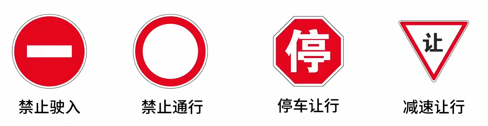
		4. 正脸是机动车，侧身是对应车型
			1. 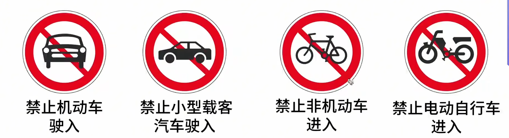
	3. 指示标志
		1. 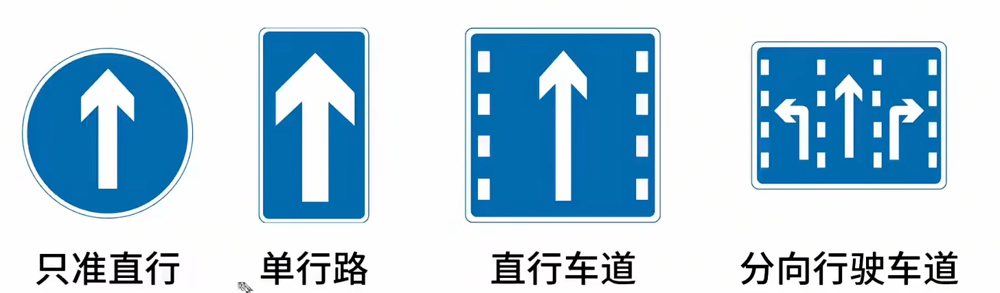
		2. 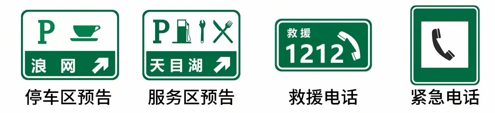
		3. 口诀
			1. 哪边箭头粗，哪边先走
			2. 顶角朝哪边哪边通行
		4. 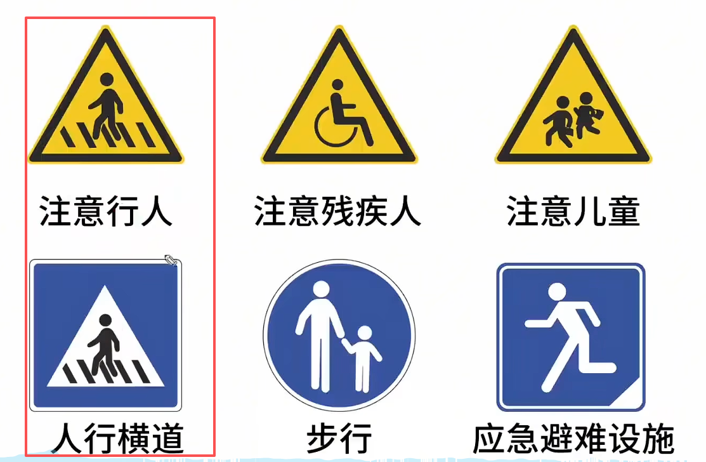
		5. 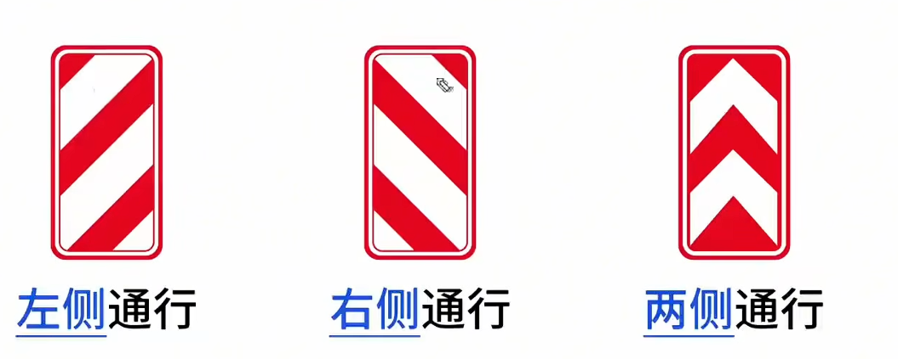
4. 禁令标识
	1. 三减八停
	2. 禁止驶入:车不能走禁止通行:车、人都不能走
	3. 正脸是机动车，侧身是对应车型
	4. 自行车是非机动车，有电箱是电动自行车
	5. 红色限制，黑色解除
	6. 圆直方单，虚车道
	7. 哪边箭头粗，哪边先走
	8. 顶角朝哪边哪边通行

## 3交通标线
1. 可跨还是不可跨
	1. 白色同向，黄色对向
	2. 实线不可跨，虚线可跨
	3. 双白实线:停车让。
	4. 双白虚线:减速让
	5. 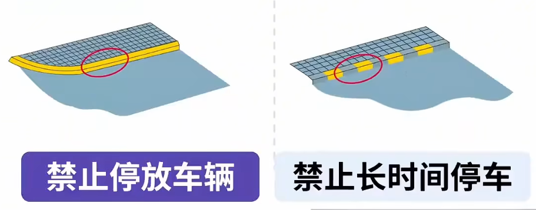
	6. 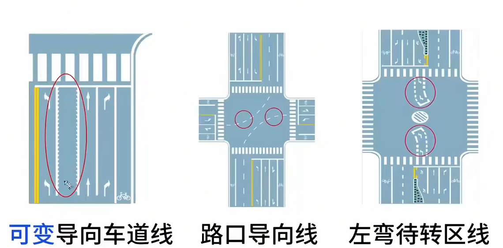
	7. 有齿——可变
	8. 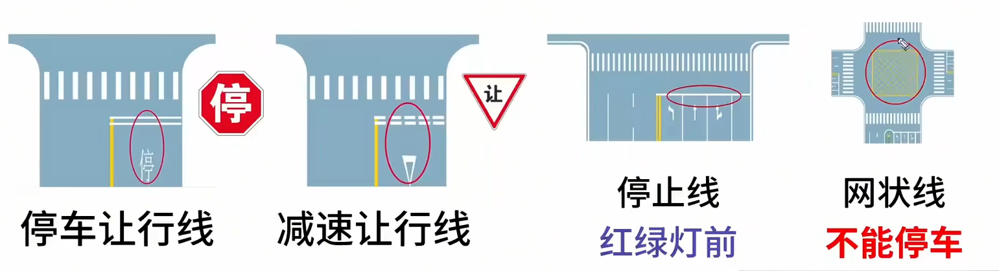
	9. 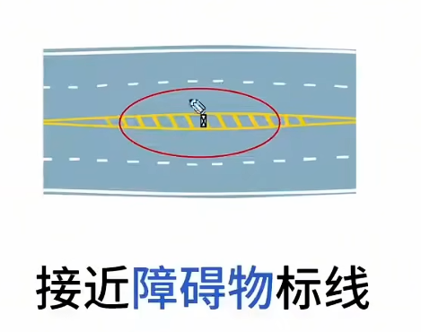
	10. 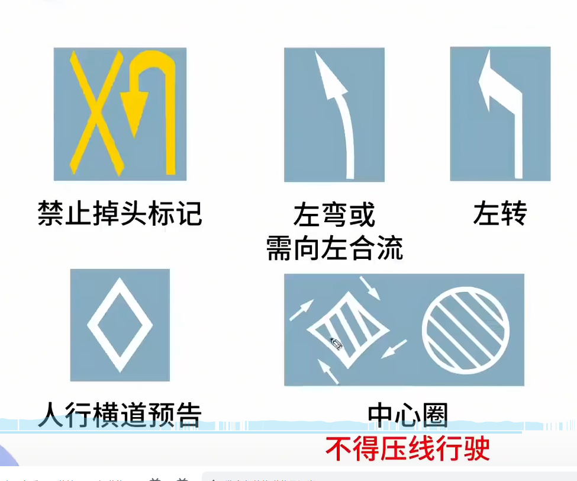
 
## 通行原则

1. 超车规定
	1. 只能从左侧超，看到右侧超越都是错的。
2. 一般说开远光都是错
3. 看到加速通过就是错
4. 错误
	1. 急转方向
	2. 紧急制动
	3. 加速
	4. 雾天远光
5. 正确
	1. 安全间距
	2. 发动机制动
	3. 稳
	4. 鸣喇叭提醒
6. 看不清：安全地点停车。
7. 临时停车：危险报警闪光灯
8. 

# 关键词

- 好感词
	1. √ 减速、停车、靠右、安全距离、礼让(不让会撞车，考试会挂科)
	2. √ 观察、依次、鸣喇叭提示(堵车依次、缓慢依次)

- 警示词
	1. 迅速、加速、快速(速度不是目的，平安才是终点)
	2. 立即、随意、空挡、滑行
	3. 紧急制动、急转向、连续/持续鸣(催促)
	只有事故无可避免，紧急制动“对”

谁先走
	右让左 弯让直 右方先行
	靠山让临崖
	有障碍让无障碍

- 校车让行
	- 一二车道停，三车道最左侧减速

- 考速度
	- 标志
		- 红高
		- 蓝低
		- 黄建议
	- 标线
		- 黄高白低
- 
	- 城市、公路
		- 无线城3公4，有线城5公7  ㊙️记住有线57；无线除以2就行
		- 
		- 1特殊路段、特殊天气、牵引故障车
		- 2直接选“30”
	- 高速车道
		- 高速各车道最低速度
			- 同向两车道
			- 100   60
			- 同向三车道
			- 110   90   60
		- 高速跟车距离
			- 车速100Km/h，车距100m
			- 低于100Km/h，车距50m
	- 特殊速度
		- 30
	- 低能见度
		- 261
		- 145
		- 520

- 停车
	- 口5站3         公共汽车站、急救站、加油站、消防栓门前

- 事故处理
	- 先稳方向再减速，非必要不急刹
	- 危险报警闪光灯
	- 车后放警告标志高速150米以外，普通道路50-100米)
	- 1协商的前提无伤亡、无争议标明位置拍照撤离
	- 2有问题都得报警!
	- 
	- 全责 ：伪造现场、货车散落货物
	- 
	- 
	- 不赔：不赔人故意、车静止
	- 般事故:机动车与人事故车无错，承担不超过10%

- 医疗急救
	- 失血
	- 有出血先止血    动脉出血近心    端包扎不用细麻绳
	- 昏迷
	- 昏迷先检查呼吸     搬运昏迷先开放气道    胸外按压100-120次/分钟
	- 骨折
	- 三角巾固定   不得随意移动   不用软担架

# 总结口诀
- 扣分
	- 1分：普倒掉、会车、**灯光**、安全带、年检、禁令标
	- 3分：普逆、电话、排队穿插、**故障灯光**、三不让
	- 6分：应急、信号灯、暂扣、逃逸轻微
	- 9分：不符、高违停、无校资
	- 12分：饮酒、高倒掉逆、买卖分、逃逸死亡
- 口诀 
	- 超速以外找6分，普普3 6，高6 12    （超速）
	- 超员7下3 6，7上6 9 100%12
	- 货车超载136
	- 信息变更30日，有效期满90日客牵不得初次申公益111;现场112;网上331
	- 车登记，照核发
	- 行人过马路，选项找停车
	- 
	- 口5站3不得停。
	- 高速低能见度261/145/520
	- 假1吊2撤3醉5逃终生
	- 假审1代审2，组3倍高2万
	- 拼装报废超50，200-2000处吊销
	- 先稳方向再减速，非必要不急刹
	- 无逃3以下 先死后逃3-7逃逸致死7以上

