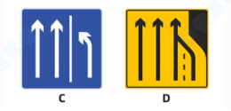

# 考试技巧
1. 第一组
	1. 题目中说属于违法行为、是违法行为、存在违法行为，答对;说属于违章行为、没有违法行为，答错。
	2. 🥑🥑题目以“拘役”结尾.答对;以“徒刑”结尾.答错。选项中看到.关键词“拘役”.答案就选这个选项。
	3. 选项对比法:三下一上.选择上;意思是选项中有三个下一个上.我们就选择带上字的。
	4. 危5.联想到(威武)
	5. 依次;选项中看到依次
	6. 题目中只有“安全距离”.答对;同时看到“低于”.答错。
	7. 关键词“安全距离”.答案就选这个
	8. 题目中看到“避免”避让“答对”。
	9. 题目中看到“只要”，答错。
	10. 选项中看到.关键词“饮酒后”.答案就选这个选项。(扣分题除外)
	11. 记关键词:立即报警;题目中看到立即报警，报警，直接选正确。
	12. 答案中看到“降低速度”直接选择这个选项
	13. 题目中有“报废”.选项中找“吊销”或“不美观"。
	14. 题目中有“超车”.答案中找“超车”。
	15. 选项中有三个“未”字.选不带“未”字的选项。
	16. 题目中有“故障”.选项中找“应急”报警”或“不妨碍”。(题目中问错误的除外)
	17. 题目中看到“加速”答错。如
	18. 果说的是“也不得加速”答对(加速后面有过急两个字的1道题除外)
	19. 题目中看到“观察”答对。
	20. 题目中看到“可不”或“可以不”.直接"答错"。
	21. 题目中问“不得超过多少”.就在选项中找“30公里/小时”,有些考场是“30KM/小时”(城市道路.公路和高速公路除外)
	22. 261、145、520 (离)
	23. 题目提到两车道:直接就选100和120。❌
	24. 关于速度的判断题:只有“30公里”80公里”“100公里”是对的，其他公里数都是错的。(题目中说“低于100公里”或“超过30公里”是错的)❌
	25. 题目中看到“及时”.“答对"。题目中看到“立即”.答错。
	26. 题目中看到“追究”.答对;“不追究”.答错。
	27. 题目中只看到“扣留”两个字.答对;扣留前有“身份证”或题尾有“行驶证”的.答错。
	28. 题目中看到“不需”、“只需”.直接“答错”。
	29. 看图答题:题目中是“真实图片”的判断题.答对;图片中“有红方框”的.答错。(注意是红框.不是红圈)
2. 第二组
	1. 题目中有“机动车”.选项中找“机动车”。
	2. 题目中看到“无争议”.“答对”。
	3. 找关联词:有争议找报警，无争议，找自行协商。
	4. 题中看到“确保安全”答案中找“恢复交通”
	5. 题目中说“警察可以”.警察有权”.答对;“警察不可以”.答错。
	6. 题目中看到“故意”."答对”。❌
	7. 题目中问“原因是什么”.答案中看到“易”字.答案就选这个选项。
	8. 题目中有“超车”.选项中找“超车”。
	9. 选择题选项中看到.关键词“终生”答案就选这个选项。(注意这个生是生活的生，不是身体的身)
	10. 选择题问“什么责任”时.就在选项中找“全部责任”或“刑事责任”。
	11. 交警左手在下.选左转弯。❌
	12. 看图答题:图片中箭头或车子穿虚线答对.穿实线答错
	13. 看图答题:四条斑马线组成一个“口”字.就在选项中找“口”❌
	14. 图中看到AB车.就在选项中找2B.哪个2B长就选哪个。
	15. 看图答题:红色圆圈套在杆子中间.答对;不在中间或没有圆圈的.答错。
3. 第三组
	1. 看图答题:图片中看到感汉号.选项中找故障或异常。❌
	2. 看图答题:图中有正负极.表示电路.就在选项中找电路。❌
	3. 题目中看到“三十日”答对.“四十日”答错
	4. 题目中看到数字“30”或“文字三十”.“答对”。
	5. “检、标、会、安、掉、灯”扣1分。    简彪(检标)会安吊(掉)灯!
	6. “警、电、低、让、插”扣3分。   开车警告手机电量低，让你插充电器扣3分。
	7. “不按规定行驶”3分对，1分错
	8. 记关键词:“以外-超”，题目中看到一个“以外-超”答案选“6分”
	9. 两个以外找6分.
	10. 关于逃逸的扣分题:轻伤、财产扣6分;重伤、死亡扣12分。
	11. 违法停车，扣9分。
	12. “车以外-9分”。一个以外答错
	13. 亡、伪、代、酒”这4个字其中任意一个字，直接选12分。谐音记忆故事:王维(亡伪)带(代)酒。
	14. 不挂、遮挡污损(看不视) 9分
	15. 题目中看到“未悬挂”直接答错，如果“未悬挂”和“记9分”同时出现答案选“正确”
	16. 手5自4
	17. 题目中看到“罚金”答对
4. 第四组
	1. 题目中看到“二百元以下”答对
	2. “二万元以下”答对
	3. 题目中看到“牟取”答对.如果题目中同时出现“9分答错
	4. 题目中没数字的罚款题:看到“罚款”，答对;“只罚款”，答错。
	5. 题中有“未取得”答案中找“吊销”
	6. 看到“再次饮酒”直接选
	7. 题目中只看到“所有权”答对.如果题目中同时有“罚款”答错
	8. 饮酒3个记分周期内不得扣减记分
	9. 题目中看到“无需”，选错误。
	10. “两年-身体”答错
	11. 🥑选项中看到“交替使用远近光灯”.直接选
	12. 🥑选项中看到.关键词“12个月”.答案就选这个选项。
	13. 题目中有“实习”.选项中找“三陪”
5. 第五组
	1. 题目中问“不得超过多少岁”有“70周岁”直接选，没有就选“63周岁”
	2. 补证比较急，选15日;其他的有90日选90日，没有90日选30日。
	3. 题目中有“驾驶证”.选项中找“驾驶证”。
	4. 初次不客牵
	5. 学习驾驶证明的有效期为3年
	6. 看见伪造/变造，找12分。
	7. 技巧:故障后第一时间要开启危险报警闪光灯.此题只要知道第一步就能做对
	8. 题目中看到“市级”答错
	9. 题目中有“危险”.选项中找“醉驾”。
	10. 二次以上、可以，答错;二次以上，（学习扣分）
	11. 关键词答题:组织作弊成犯罪，选处三年以上七年以下有期徒刑，并处罚金
	12. 车型
		1. 1客2货
		2.  ABC 大中小
	13. 题目中看到“网状线”.直接“答错”。

看图答题:黄高白低.黄色数字表示最高限速.白色数字表示最低限速。交卷
看图答题:双黄虚线象下雨.下雨会潮湿.所以就在选项中找潮汐。
题目中有“驶离”.就在选项中找“驶入”。
图中有正负极.表示电路.
🥑审验是30天，有效期满是90天
题目中只看到“报废”，答对;同时看到“上路”，答错。

尽快合流:车道变少